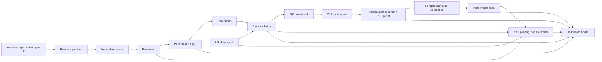
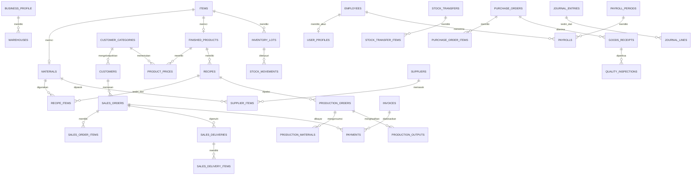

# Product Requirements Document (PRD)

## ERP Pabrik Roti Hanan

| Informasi | Nilai |
|---|---|
| Produk | ERP Pabrik Roti Hanan |
| Pemilik bisnis | Bapak Asep |
| Lokasi utama | Bandung |
| Versi dokumen | 1.3 |
| Status | Draft diperbarui — konversi satuan otomatis telah dirinci |
| Tanggal | 25 Agustus 2026 |
| Platform | Web responsif untuk mobile, tablet, laptop, dan PC |
| Frontend | Next.js |
| Backend, database, dan deployment | InsForge |

---

## 1. Overview

### 1.1 Ringkasan produk

ERP Pabrik Roti Hanan adalah aplikasi operasional terpadu untuk mengelola seluruh kegiatan pada satu pusat/pabrik di Bandung. Model bisnis penjualan adalah business-to-business (B2B) dengan dua kategori pelanggan eksternal: **Agen 1** dan **Agen 2**. Aplikasi menghubungkan tujuh area utama:

1. Penjualan dan POS.
2. Inventori dan gudang.
3. Keuangan dan kas.
4. HR dan payroll.
5. Produksi dan QC.
6. Purchasing.
7. Dashboard analitik.

Produksi, gudang, penjualan, kas, HR, dan keuangan berlangsung pada satu pusat Bandung. Produk jadi dijual langsung atau dipenuhi berdasarkan pesanan Agen 1/Agen 2, kemudian diambil oleh agen atau dikirim oleh Roti Hanan. Setiap transaksi hanya dicatat satu kali dan dampaknya diteruskan ke bagian terkait, sehingga tidak ada pencatatan ulang antarmodul.

Contoh keterhubungan:

- Setiap role memperoleh menu Master Data yang relevan dan hanya dapat mengubah bagian data sesuai tanggung jawabnya; seluruh modul tetap memakai satu sumber data yang sama.
- Penjualan langsung di pusat atau pesanan agen yang telah diserahterimakan mengurangi stok pusat dan mencatat pembayaran/piutang.
- Pesanan Agen 1/Agen 2 menjadi masukan rencana produksi dan pemenuhan pesanan.
- Penerimaan pembelian dikonversi dari satuan beli ke satuan stok, dicatat sebagai stok fisik, lalu hanya menjadi stok siap pakai setelah lulus QC bila barang mewajibkan QC.
- Penyelesaian produksi mengurangi bahan baku, menambah produk jadi, dan mencatat biaya serta waste.
- Kehadiran dan lembur menjadi dasar payroll dan biaya tenaga kerja.
- Seluruh transaksi memperbarui dashboard Bapak Asep.

### 1.2 Masalah yang diselesaikan

- Data penjualan, stok, produksi, pembelian, keuangan, dan HR tersebar.
- Stok bahan dan produk pada berbagai area gudang internal sulit dipastikan secara cepat.
- Produk roti memiliki masa simpan pendek sehingga rawan kedaluwarsa dan waste.
- Riwayat batch dari bahan baku sampai pesanan dan agen penerima sulit ditelusuri.
- Pesanan agen, rencana produksi, persediaan, dan pembelian belum terhubung langsung.
- Owner membutuhkan ringkasan kondisi usaha tanpa memeriksa catatan satu per satu.
- Perubahan, pembatalan, selisih stok, dan selisih kas membutuhkan jejak pemeriksaan yang jelas.

### 1.3 Tujuan produk

- Menjadi sumber data utama operasional Roti Hanan.
- Memberikan informasi yang tepat kepada setiap role sesuai tanggung jawabnya di pusat Bandung.
- Menghubungkan pesanan agen, pembelian, produksi, QC, stok, pemenuhan/pengiriman, penjualan, keuangan, dan payroll.
- Mempercepat pengambilan keputusan melalui dashboard, peringatan, dan daftar tugas.
- Menekan selisih stok, produk kedaluwarsa, waste produksi, keterlambatan pesanan, dan selisih kas.
- Menyediakan penelusuran batch dan riwayat perubahan yang dapat dipertanggungjawabkan.
- Tetap sederhana digunakan oleh staf operasional melalui tampilan berbasis pekerjaan.

### 1.4 Indikator keberhasilan awal

Target berikut merupakan target awal dan dapat disesuaikan setelah tersedia data operasional nyata.

| Indikator | Target awal |
|---|---:|
| Akurasi stok barang utama | Minimal 98% |
| Transaksi penjualan tercatat pada hari yang sama | 100% |
| Batch produk jadi dapat ditelusuri ke bahan, pesanan, dan agen penerima | Maksimal 5 menit |
| Penerimaan bahan memiliki hasil QC | 100% untuk bahan yang wajib QC |
| Produksi memiliki catatan target, hasil baik, dan waste | 100% batch |
| Selisih kas memiliki alasan dan penyelesaian | 100% |
| Persetujuan penting memiliki riwayat | 100% |
| Dashboard harian tersedia untuk Owner | Setiap hari operasional |

### 1.5 Ruang lingkup

#### Termasuk

- Satu badan usaha Roti Hanan.
- Satu pusat/pabrik Roti Hanan di Bandung tanpa cabang.
- Area gudang internal untuk bahan baku, kemasan, karantina, produk jadi, barang ditolak, dan barang dalam pengiriman.
- Penjualan B2B kepada Agen 1 dan Agen 2 melalui POS pusat, pesanan, penawaran, pembayaran, retur, pengambilan, pengiriman, dan tutup shift POS.
- Master pelanggan yang tetap dipisahkan dalam kategori Agen 1 dan Agen 2, lengkap dengan kontak, alamat, termin, batas kredit, catatan, dan status aktif.
- Master supplier berkode unik, lengkap dengan kontak, alamat, termin, catatan, dan status aktif.
- Master Barang/Bahan yang hanya terdiri dari Bahan Baku dan Kemasan, serta Master Barang Jadi yang terpisah secara bisnis dan tampilan.
- Dua harga jual yang wajib tersedia untuk setiap Barang Jadi: Harga Agen 1 dan Harga Agen 2. Tidak ada harga jual umum.
- Menu Master Data tersedia pada setiap role dengan isi dan hak edit sesuai bagian yang menjadi tanggung jawab role tersebut.
- Pemenuhan pesanan agen dari alokasi stok atau kebutuhan produksi sampai bukti serah terima.
- Bahan, resep, rencana produksi, batch produksi, hasil, waste, dan QC.
- Permintaan pembelian, perbandingan penawaran supplier, pesanan pembelian, penerimaan, retur, dan evaluasi supplier.
- Kas, bank, biaya, piutang, utang, jurnal akuntansi, harga pokok, anggaran, dan laporan keuangan dasar.
- Data karyawan, jadwal, kehadiran, lembur, cuti, payroll, dan slip gaji.
- Dashboard per role, laporan, notifikasi, persetujuan, lampiran, dan audit log.

#### Belum termasuk dalam rilis awal

- Toko daring publik atau integrasi marketplace.
- Portal atau akun pemesanan mandiri untuk agen; seluruh pesanan rilis awal dimasukkan oleh staf internal.
- Pelacakan kendaraan dengan GPS.
- Aplikasi native Android atau iOS; rilis awal berupa web responsif/PWA.
- Sistem perawatan mesin yang lengkap; rilis awal hanya mencatat pemakaian dan kendala mesin produksi.
- Integrasi otomatis perbankan dan pelaporan pajak eksternal.
- Prediksi berbasis AI; rilis awal menggunakan histori, rata-rata, target, dan aturan stok.
- Pengelolaan stok milik agen setelah barang diserahterimakan.
- Operasional multi-pusat atau cabang.

### 1.6 Asumsi operasional

- Seluruh produksi, gudang, penjualan, kas, HR, dan keuangan berada pada satu pusat Bandung.
- Agen 1 dan Agen 2 adalah pelanggan eksternal, bukan lokasi usaha atau pengguna aplikasi.
- Hanya ada dua kategori pelanggan karena model penjualan Roti Hanan adalah B2B.
- Setiap Barang Jadi memiliki Harga Agen 1 dan Harga Agen 2; POS selalu memilih harga berdasarkan kategori pelanggan dan tidak menggunakan harga jual umum.
- Pelanggan tetap disajikan dalam dua bagian Master Data: Agen 1 dan Agen 2.
- Data master bersifat bersama. Role tidak memiliki salinan master sendiri, tetapi mendapat hak lihat/ubah sampai tingkat bagian atau field sesuai tanggung jawabnya.
- Satuan beli Barang/Bahan dapat berbeda dari satuan isi dan satuan stok. Isi kemasan dimasukkan manual, sedangkan faktor antar-satuan sekelompok dihitung otomatis. Kuantitas stok masuk dihitung dengan rumus `jumlah beli × isi per satuan beli × faktor otomatis satuan isi ke satuan stok`.
- Jenis pada Master Barang/Bahan hanya **Bahan Baku** dan **Kemasan**. Barang Jadi dikelola pada master terpisah.
- Aplikasi tidak menggunakan barcode produk pada rilis awal; pencarian memakai kode dan nama.
- Pesanan diterima melalui WhatsApp, telepon, atau kedatangan langsung, kemudian dimasukkan oleh Admin Penjualan/Sales.
- Penjualan langsung melalui POS pusat tetap tersedia.
- Pesanan dapat diambil sendiri atau dikirim oleh Roti Hanan. Untuk pengiriman, penjualan dan pengeluaran stok final diakui setelah barang diterima agen.
- Stok milik agen tidak dipantau setelah serah terima.
- Mata uang utama adalah rupiah dan zona waktu operasional adalah Asia/Jakarta.
- Setiap pengguna hanya memiliki satu role aktif dan tidak memerlukan pemilih lokasi.
- Bapak Asep menjadi pengguna awal dengan role Owner dan cakupan seluruh perusahaan.
- Pembayaran mendukung tunai, transfer, QRIS, uang muka, pembayaran sebagian/cicilan, dan kredit/tempo sesuai kebijakan yang dikonfigurasi.
- Aturan diskon, batas persetujuan, formula payroll, pajak, dan penomoran dokumen dapat dikonfigurasi.

---

## 2. Requirements

### 2.1 Role dan hak akses

| Role | Cakupan data | Boleh melakukan | Batasan utama |
|---|---|---|---|
| Owner — Bapak Asep | Seluruh perusahaan | Melihat semua dashboard/laporan, mengelola seluruh Master Data, memberi persetujuan, mengatur kebijakan, melihat audit | Perubahan transaksi tetap harus melalui koreksi resmi dan tercatat |
| Admin Penjualan/Sales | Seluruh proses penjualan B2B di pusat | POS, penawaran, pesanan Agen 1/Agen 2, pembayaran, pengambilan/pengiriman, retur sesuai batas, shift POS, identitas agen, dan harga jual kategori | Tidak melihat resep, payroll, biaya produk lengkap, atau mengubah batas kredit tanpa hak Finance |
| Staff Gudang | Seluruh area gudang internal sesuai pekerjaannya | Penerimaan, perpindahan, pengeluaran, stok opname, picking, packing, serta parameter stok dan satuan stok pada master | Tidak mengubah harga beli/jual, hasil QC, jurnal, atau menyetujui koreksi stok besar |
| Staff Produksi | Pusat Bandung | Rencana, pemakaian bahan, proses, hasil, waste, kendala, Master Barang Jadi bagian produksi, dan resep | Tidak meluluskan QC atau mengubah harga jual/transaksi keuangan |
| QC Inspector | Pusat Bandung dan seluruh area pemeriksaan | Memeriksa, menahan, meluluskan, menolak, mengelola template/persyaratan QC, mencatat penyimpangan dan tindakan | Tidak mengubah hasil produksi, jumlah stok, harga, atau pembayaran |
| Staff Purchasing | Seluruh kebutuhan pembelian | Master Supplier, Master Barang/Bahan bagian pembelian, permintaan/penawaran, PO, dan pemantauan pengiriman | Tidak membayar supplier atau menyetujui pembeliannya sendiri di atas batas |
| Admin HR/Finance | Seluruh perusahaan sesuai fungsi | Karyawan/user, termin dan batas kredit pelanggan, termin supplier, kas, bank, biaya, utang, piutang, jurnal, laporan, dan payroll | Tidak mengubah hasil produksi, keputusan QC, atau stok tanpa proses koreksi |

Hak akses dibatasi berdasarkan **hak fitur**: menu, data sensitif, dan tindakan yang boleh digunakan oleh role. Karena hanya ada satu pusat, aplikasi tidak memakai pemilih atau batas akses lokasi. Setiap pengguna hanya boleh mempunyai satu role aktif.

#### Akses Master Data per role

Setiap role mempunyai menu **Master Data**, tetapi menu, tab, tombol, dan field yang dapat diubah mengikuti tanggung jawab role. Satu record tidak diduplikasi antar-role; semua role terkait membaca sumber data yang sama.

| Master/Bagian | Pengelola utama | Akses role terkait |
|---|---|---|
| Pelanggan — identitas, kategori Agen 1/Agen 2, kontak, alamat, kota, catatan, status | Admin Penjualan/Sales, Owner | Finance dapat melihat; role operasional hanya melihat data yang diperlukan untuk tugasnya |
| Pelanggan — tempo pembayaran dan batas kredit/batas hutang maksimum | Admin HR/Finance, Owner | Admin Penjualan/Sales dapat melihat saat POS/pesanan tetapi tidak mengubah tanpa hak |
| Harga Agen 1 dan Harga Agen 2 per Barang Jadi | Admin Penjualan/Sales, Owner | Finance dapat melihat untuk invoice/margin; POS hanya memakai harga yang aktif |
| Supplier — identitas, kontak, alamat, kota, catatan, status | Staff Purchasing, Owner | Finance dapat melihat dan mengelola termin pembayaran; Gudang/QC melihat data penerimaan terkait |
| Barang/Bahan — identitas, jenis Bahan Baku/Kemasan, satuan beli, isi per satuan beli, satuan isi, dan harga beli | Staff Purchasing, Owner | Gudang dan Produksi dapat melihat; nilai konversi akhir dihitung otomatis setelah satuan stok ditentukan |
| Barang/Bahan — satuan stok, stok minimum, umur simpan, dan status | Staff Gudang, Owner | Purchasing, Produksi, dan QC dapat melihat |
| Barang/Bahan — wajib QC dan template pemeriksaan | QC Inspector, Owner | Gudang/Purchasing dapat melihat status dan hasil, tetapi tidak menentukan keputusan QC |
| Barang Jadi — kode, nama, jenis produk, satuan jual/stok, berat, umur simpan, dan status | Staff Produksi, Owner | Sales, Gudang, dan QC dapat melihat |
| Barang Jadi — stok minimum | Staff Gudang, Owner | Produksi dan Sales dapat melihat |
| Barang Jadi — QC akhir dan template pemeriksaan | QC Inspector, Owner | Produksi/Gudang dapat melihat; seluruh Barang Jadi wajib lulus QC sebelum siap jual |
| Resep dan proses standar | Staff Produksi, Owner; review QC sesuai kebijakan | Sales/Purchasing tidak dapat melihat formula sensitif |
| Karyawan, user, dan komponen payroll | Admin HR/Finance, Owner | Role lain tidak dapat melihat data gaji sensitif |

Perubahan kategori agen, satuan, konversi, harga, termin, batas kredit, persyaratan QC, dan status aktif wajib masuk audit log. Record master yang pernah dipakai transaksi tidak dapat dihapus permanen dan hanya dapat dinonaktifkan.

#### Model akun, role, dan password

- Setiap orang memiliki **satu akun pribadi** dengan Gmail, username unik, dan password sendiri.
- Pengguna dapat login memakai Gmail atau username yang terdaftar, menggunakan password pribadi yang sama.
- Password melekat pada user, bukan pada role. Dua Admin Penjualan/Sales tidak boleh memakai satu akun/password yang sama.
- Owner atau Admin HR/Finance membuat akun, menghubungkannya dengan data karyawan, lalu menetapkan tepat satu role.
- Hanya Owner yang dapat memberikan atau mencabut role Owner. Admin HR/Finance tidak dapat menaikkan akses dirinya sendiri.
- Akun baru menerima password sementara atau undangan aktivasi dan wajib mengganti password saat login pertama.
- Pengguna tidak dapat memilih sembarang role pada halaman login.
- Setelah login berhasil, aplikasi langsung membuka beranda sesuai role user tanpa selector role/lokasi.
- Lupa password menggunakan alur reset InsForge Auth. Password tidak pernah disimpan pada tabel aplikasi atau ditampilkan kembali oleh Admin.
- Akun dapat dinonaktifkan tanpa menghapus nama pengguna dari riwayat transaksi.
- Pembuatan akun, perubahan role, reset password, penonaktifan, dan login penting dicatat pada audit keamanan.

### 2.2 Kebutuhan fungsional umum

| ID | Requirement | Prioritas |
|---|---|---|
| FR-001 | Pengguna masuk menggunakan Gmail atau username dengan password pribadi serta hanya melihat menu sesuai satu role yang ditugaskan | Must |
| FR-002 | Data dan tindakan operasional dibatasi berdasarkan role; tidak ada selector lokasi karena hanya ada satu pusat | Must |
| FR-003 | Beranda menampilkan tugas, peringatan, persetujuan, dan ringkasan yang relevan | Must |
| FR-004 | Semua dokumen memiliki nomor unik, status, pembuat, waktu, dan riwayat | Must |
| FR-005 | Transaksi selesai tidak dapat dihapus; koreksi wajib memiliki alasan dan persetujuan | Must |
| FR-006 | Dokumen/foto dapat dilampirkan pada penerimaan, QC, pengeluaran, karyawan, dan pengiriman | Must |
| FR-007 | Pencarian tersedia untuk barang, batch, transaksi, pelanggan, supplier, dan karyawan | Must |
| FR-008 | Daftar dapat difilter menurut tanggal, area gudang/kategori pelanggan bila relevan, status, dan kata kunci | Must |
| FR-009 | Laporan dapat diunduh sebagai PDF atau spreadsheet | Should |
| FR-010 | Peringatan penting dapat muncul pada aplikasi dan dashboard | Must |
| FR-011 | Persetujuan dapat dilakukan dari mobile atau desktop | Must |
| FR-012 | Pengguna dapat melihat riwayat perubahan sesuai hak akses | Must |
| FR-013 | Data waktu ditampilkan dalam WIB dan nilai uang dalam rupiah | Must |
| FR-014 | Barang dan produk dicari melalui kode atau nama; barcode produk tidak digunakan pada rilis awal | Must |
| FR-015 | Aplikasi mempertahankan draft/form ketika koneksi terputus singkat | Must |
| FR-016 | Antrean penjualan offline penuh dan sinkronisasi otomatis tersedia pada fase lanjutan | Could |
| FR-017 | Owner/Admin dapat membuat, mengundang, mereset, menonaktifkan user, serta menetapkan tepat satu role | Must |
| FR-018 | Sistem menolak pemberian lebih dari satu role aktif kepada satu user dan tidak menyediakan selector role/lokasi | Must |
| FR-019 | Password sementara wajib diganti pada login pertama; password user tidak dapat dilihat Admin | Must |
| FR-020 | Setiap role mempunyai menu Master Data yang hanya menampilkan bagian dan tindakan sesuai hak role | Must |
| FR-021 | Daftar pelanggan pada Master Data dipisahkan menjadi tab Agen 1 dan Agen 2; form dari masing-masing tab otomatis mengunci kategori terkait | Must |
| FR-022 | Sistem mendukung hak edit sampai tingkat bagian/field sehingga beberapa role dapat mengelola bagian berbeda dari satu record tanpa membuat duplikasi | Must |
| FR-023 | Master Barang/Bahan dan Master Barang Jadi disajikan sebagai menu, form, dan model bisnis terpisah | Must |
| FR-024 | Data master yang telah digunakan transaksi hanya dapat dinonaktifkan, bukan dihapus permanen | Must |

### 2.3 Aturan bisnis utama

1. Stok hanya berubah melalui transaksi resmi: penerimaan, produksi, perpindahan area internal, penjualan/serah terima, retur, koreksi, atau pemusnahan.
2. Produk/bahan yang memiliki batch wajib mencantumkan batch dan tanggal kedaluwarsa ketika relevan.
3. Sistem menyarankan batch dengan kedaluwarsa terdekat untuk digunakan atau dijual terlebih dahulu.
4. Bahan yang wajib QC belum menjadi stok siap pakai sebelum lulus pemeriksaan.
5. Produk jadi belum menjadi stok siap jual sebelum lulus QC akhir.
6. Staff Produksi tidak dapat meluluskan hasil produksinya sendiri.
7. Selisih stok, selisih kas, retur besar, diskon besar, dan transaksi di luar batas memerlukan persetujuan.
8. Agen 1 dan Agen 2 adalah pelanggan eksternal. Pengiriman kepada agen merupakan pemenuhan penjualan, bukan transfer internal antarlokasi.
9. Untuk pesanan yang dikirim, stok yang diberangkatkan berpindah ke status **dalam pengiriman**; penjualan dan pengeluaran stok final diakui setelah agen mengonfirmasi penerimaan. Untuk pengambilan langsung/POS, pengakuan terjadi saat serah terima.
10. Stok agen tidak dicatat sebagai persediaan Roti Hanan setelah serah terima selesai.
11. Pembatalan/retur setelah transaksi selesai membuat transaksi pembalik yang tercatat; barang retur hanya kembali menjadi stok siap jual setelah kondisinya dinilai layak.
12. Tidak ada harga jual umum. Setiap Barang Jadi wajib memiliki Harga Agen 1 dan Harga Agen 2; POS/pesanan otomatis memilih harga sesuai kategori pelanggan dan menyimpan snapshot harga pada transaksi.
13. Pesanan agen hanya dapat dimasukkan oleh Admin Penjualan/Sales internal; agen tidak memiliki akun aplikasi pada rilis awal.
14. Aktivitas yang berdampak keuangan menghasilkan catatan jurnal hanya setelah transaksi dikonfirmasi sesuai titik pengakuannya.
15. Jurnal, pergerakan stok, dan audit log bersifat append-only; perbaikan dilakukan dengan entri pembalik/koreksi.
16. Perubahan resep menghasilkan versi baru, bukan menimpa resep yang sudah digunakan batch lama.
17. Perubahan rekening supplier dan data gaji adalah data sensitif yang membutuhkan akses khusus.
18. Semua saldo inventori disimpan dalam satuan stok barang. Input pembelian memakai satuan beli; isi kemasan, satuan isi, dan hasil konversi otomatis ke satuan stok disimpan sebagai snapshot transaksi.
19. Master Barang/Bahan hanya memiliki jenis **Bahan Baku** atau **Kemasan**. Barang Jadi adalah master terpisah dan merupakan hasil produksi yang dapat dijual.
20. Sistem tidak menyimpan barcode produk pada rilis awal; kode Barang/Bahan, kode Barang Jadi, kode pelanggan, dan kode supplier wajib unik.
21. Setiap Barang/Bahan memiliki satuan beli, isi per satuan beli, satuan isi, dan satuan stok. Sistem menghitung nilai konversi akhir dengan rumus `isi per satuan beli × faktor otomatis satuan isi ke satuan stok`; stok masuk dihitung `jumlah beli × nilai konversi akhir` dan harga per satuan stok dihitung `harga beli per satuan beli ÷ nilai konversi akhir`.
22. Konversi otomatis hanya diperbolehkan dalam kelompok yang sama: Berat (`Ton`, `Kg`, `Gram`, `Mg`), Volume (`Liter`, `Ml`), atau Jumlah (`Pcs`, `Lusin`, `Kodi`, `Gross`). Konversi beda kelompok seperti Kg ke Liter atau Liter ke Pcs ditolak. `Karung`, `Sak`, `Pack`, `Dus`, `Karton`, `Botol`, `Kaleng`, dan `Roll` diperlakukan sebagai kemasan dengan isi yang harus dimasukkan manual.
23. Jumlah PO dan harga beli dimasukkan dalam satuan beli, sedangkan saldo, stok minimum, pemakaian resep, reservasi, dan pergerakan inventori disimpan dalam satuan stok.
24. Satuan stok Barang Jadi sama dengan satuan jual. Berat disimpan sebagai nilai dan satuan berat terpisah dari kuantitas stok.
25. Master pelanggan selalu disajikan dalam dua bagian, Agen 1 dan Agen 2. Pelanggan nonaktif tidak dapat dipilih pada transaksi baru.
26. Tempo pembayaran pelanggan dan supplier disimpan sebagai jumlah hari; nilai `0` berarti tunai. Batas Kredit adalah nilai maksimum total hutang/piutang terbuka pelanggan kepada Roti Hanan.
27. Transaksi kredit yang melampaui sisa batas kredit ditolak atau masuk persetujuan Owner sesuai aturan yang dikonfigurasi.
28. Barang wajib QC yang diterima dicatat sebagai stok fisik berstatus karantina; kuantitas tersebut tidak termasuk stok tersedia sebelum lulus. Pemeriksaan dasar gudang tetap wajib untuk barang yang tidak mewajibkan QC.
29. Seluruh Barang Jadi hasil produksi wajib menjalani QC akhir dan belum menjadi stok siap jual sebelum keputusan lulus.
30. Keputusan QC bahan masuk adalah lulus, ditahan, atau ditolak; QC produk jadi juga dapat menghasilkan rework. Hanya QC Inspector/Owner berwenang yang dapat menetapkan keputusan.
31. Perubahan kategori agen, harga, tempo, batas kredit, satuan, isi kemasan, konversi, persyaratan QC, dan status aktif menyimpan nilai lama, nilai baru, pelaku, waktu, dan alasan.

### 2.4 Kebutuhan nonfungsional

| Area | Spesifikasi |
|---|---|
| Kemudahan penggunaan | Tampilan berbasis tugas; maksimal tiga langkah untuk pekerjaan harian utama setelah memilih dokumen |
| Responsif | Seluruh halaman penting dapat digunakan pada mobile 360 px sampai desktop besar |
| Kinerja | Halaman operasional umum ditargetkan tampil dalam 3 detik pada koneksi normal; daftar selalu memakai pagination |
| Keamanan | Autentikasi InsForge, session aman, RLS per role, API key admin hanya di server |
| Integritas | Proses stok, keuangan, produksi, dan payroll penting dijalankan secara atomik |
| Audit | Perubahan penting menyimpan pengguna, waktu, nilai lama/baru, alasan, dan referensi |
| Privasi | Data gaji, identitas karyawan, harga pokok, dan laporan keuangan hanya untuk role berwenang |
| Keandalan | Tidak ada hard delete untuk transaksi selesai; backup dan prosedur pemulihan disiapkan |
| Aksesibilitas | Label jelas, navigasi keyboard pada POS/desktop, kontras warna memadai, status tidak hanya dibedakan dengan warna |
| Skalabilitas | Penambahan area gudang internal, agen, barang, dan pengguna tidak memerlukan perubahan struktur aplikasi |
| Observabilitas | Error frontend, function, database, dan deployment dapat ditelusuri melalui log |

---

## 3. Core Features dan Spesifikasi

Keterangan prioritas:

- **Must:** wajib tersedia pada MVP.
- **Should:** sangat penting, dapat diselesaikan setelah alur MVP stabil.
- **Could:** pengembangan lanjutan.

### 3.1 Fondasi dan data bersama

| ID | Fitur | Subfitur dan spesifikasi | Role | Prioritas |
|---|---|---|---|---|
| FND-01 | Akun, login, dan sesi | Buat/undang user dengan Gmail dan username unik; login memakai salah satunya serta password pribadi; password sementara, wajib ganti pertama kali, lupa/reset, logout, session aman, blokir akun tidak aktif | Semua; pengelolaan oleh Owner/Admin HR/Finance | Must |
| FND-02 | Role tunggal | Owner/Admin menetapkan tepat satu role per user; tidak ada selector role/lokasi; pemeriksaan hak dilakukan di setiap tindakan | Owner, Admin HR/Finance | Must |
| FND-03 | Profil pusat dan area gudang | Identitas satu pusat Bandung serta area gudang internal, tipe area, alamat, dan status aktif | Owner, Admin HR/Finance | Must |
| FND-04 | Master Barang/Bahan | Kode, nama, jenis Bahan Baku/Kemasan, satuan beli, isi per satuan beli, satuan isi, satuan stok, konversi otomatis sekelompok, harga beli per satuan beli, stok minimum, umur simpan, wajib QC, dan status aktif; tanpa barcode | Owner, Purchasing, Gudang, QC sesuai bagian | Must |
| FND-05 | Master Barang Jadi | Kode produk, nama, jenis produk, satuan jual yang sekaligus menjadi satuan stok, berat, umur simpan, Harga Agen 1, Harga Agen 2, stok minimum, QC akhir wajib, dan status aktif; terpisah dari Barang/Bahan | Owner, Produksi, Sales, Gudang, QC sesuai bagian | Must |
| FND-06 | Master Pelanggan | Dua tab tetap Agen 1/Agen 2; kode, nama pelanggan, nama kontak, nomor HP, alamat, kota, tempo pembayaran dalam hari, batas kredit, catatan, dan status aktif | Owner, Sales, Finance sesuai bagian | Must |
| FND-07 | Master Supplier | Kode supplier unik, nama, nama kontak, nomor HP, alamat, kota, tempo pembayaran dalam hari, catatan, dan status aktif | Owner, Purchasing, Finance sesuai bagian | Must |
| FND-08 | Master Data berbasis role | Menu Master Data pada setiap role; visibilitas menu, record, tindakan, dan field mengikuti matriks hak tanpa menggandakan record | Semua sesuai hak | Must |
| FND-09 | Persetujuan | Batas nilai/selisih/diskon/kredit, antrean persetujuan, setuju/tolak, alasan dan waktu | Owner, role pengaju | Must |
| FND-10 | Lampiran | Foto dan dokumen dengan akses privat; simpan URL dan storage key | Role terkait | Must |
| FND-11 | Audit dan notifikasi | Riwayat perubahan master/transaksi, pemberitahuan dalam aplikasi, tautan ke dokumen terkait | Owner, role terkait | Must |

**Kriteria penerimaan fondasi:** pengguna tidak dapat membaca atau mengubah data/field di luar role-nya dan tidak dapat memiliki lebih dari satu role aktif; setiap role melihat menu Master Data yang relevan; perubahan sensitif selalu meninggalkan audit; master yang pernah dipakai hanya dapat dinonaktifkan; lampiran privat tidak dapat dibuka tanpa izin.

#### Contoh Master Barang/Bahan dan konversi

| Kode | Nama | Satuan beli | Isi per beli | Satuan isi | Satuan stok | Konversi akhir otomatis | Harga beli | Contoh stok masuk |
|---|---|---|---:|---|---|---:|---:|---|
| BB-001 | Tepung Terigu | Karung | 25 | Kg | Kg | 25 Kg/Karung | Rp300.000/Karung | Beli 2 Karung → 50 Kg |
| BB-005 | Ragi | Pack | 500 | Gram | Gram | 500 Gram/Pack | Rp40.000/Pack | Beli 3 Pack → 1.500 Gram |
| KP-001 | Plastik Roti | Pack | 100 | Pcs | Pcs | 100 Pcs/Pack | Sesuai master | Beli 5 Pack → 500 Pcs |
| BB-099 | Contoh Tepung | Karung | 15 | Kg | Gram | 15.000 Gram/Karung | Rp300.000/Karung | Beli 2 Karung → 30.000 Gram |

Untuk Tepung BB-001, biaya dasar persediaan adalah `Rp300.000 ÷ 25 = Rp12.000/Kg`. Pada contoh BB-099, sistem mengubah `15 Kg × 1.000 = 15.000 Gram/Karung`, sehingga biaya dasarnya `Rp300.000 ÷ 15.000 = Rp20/Gram`. Nilai transaksi pembelian tetap memakai harga per satuan beli, sedangkan stok dan pemakaian produksi memakai satuan stok.

#### Contoh Master Barang Jadi

Barang Jadi awal dapat mencakup `RJ-001 Roti Sobek Coklat`, `RJ-002 Roti Tawar`, `RJ-003 Croissant`, dan `RJ-004 Donat`. Contoh detail `RJ-001`: satuan jual/stok Pcs, berat 80 Gram, umur simpan 5 hari, stok minimum 100 Pcs, serta Harga Agen 1 dan Harga Agen 2 yang wajib diisi terpisah. Nilai berat tidak menambah stok dalam Gram; stok produk tetap dihitung dalam Pcs.

### 3.2 Penjualan dan POS

| ID | Fitur | Subfitur dan spesifikasi | Role | Prioritas |
|---|---|---|---|---|
| SAL-01 | POS pusat | Pilih pelanggan aktif pada tab/kategori Agen 1 atau Agen 2, cari produk melalui kode/nama, keranjang, stok tersedia, harga kategori otomatis, pemeriksaan tempo/batas kredit, diskon sesuai batas, tunai/transfer/QRIS, struk | Admin Penjualan/Sales | Must |
| SAL-02 | Shift POS | Kas awal, uang masuk/keluar, ringkasan metode bayar, uang fisik, selisih dan alasan, tutup shift | Admin Penjualan/Sales, Owner, Admin HR/Finance | Must |
| SAL-03 | Pesanan agen | Pesanan dari WhatsApp/telepon/kedatangan langsung, tanggal kebutuhan, alokasi/produksi, uang muka, cicilan, kredit/tempo, pengiriman/pengambilan | Admin Penjualan/Sales, Owner | Must |
| SAL-04 | Penawaran | Versi penawaran, masa berlaku, Harga Agen 1/Harga Agen 2 sebagai dasar, diskon terkontrol, snapshot harga, dan konversi menjadi pesanan | Admin Penjualan/Sales, Owner | Should |
| SAL-05 | Pelanggan B2B | Dua tab Agen 1/Agen 2; kode, nama pelanggan/kontak, HP, alamat, kota, riwayat pembelian, tempo hari, batas kredit, saldo piutang, catatan, dan status | Admin Penjualan/Sales, Admin HR/Finance, Owner sesuai bagian | Must |
| SAL-06 | Retur dan pembatalan | Pilih transaksi asal, barang/batch, alasan, kondisi barang, pengembalian dana/pengurang piutang, persetujuan sesuai batas | Admin Penjualan/Sales, Gudang, Owner | Must |
| SAL-07 | Harga kategori | Tepat dua harga jual aktif per Barang Jadi—Harga Agen 1 dan Harga Agen 2—tanpa harga umum; histori perubahan, tanggal efektif, status, dan batas diskon | Owner, Admin Penjualan/Sales | Must |
| SAL-08 | Laporan penjualan | Ringkasan utama penjualan per kategori Agen 1/Agen 2, dengan drill-down ke transaksi, diskon, retur, pembayaran, dan margin | Owner, Admin HR/Finance, Admin Penjualan/Sales terbatas | Must |

**Kriteria penerimaan penjualan:** setiap transaksi wajib memakai pelanggan aktif berkategori Agen 1/Agen 2; harga dipilih otomatis dari Harga Agen 1/Harga Agen 2 dan disimpan sebagai snapshot; tempo serta sisa batas kredit diperiksa sebelum transaksi kredit. Pengambilan langsung mengurangi stok saat serah terima; pengiriman mengurangi stok final dan mengakui penjualan saat penerimaan agen dikonfirmasi. Transaksi mencatat pembayaran/piutang dan jurnal tepat satu kali, dapat menghasilkan struk/invoice/surat jalan, serta tetap dapat ditelusuri setelah retur.

### 3.3 Inventori, gudang, dan pemenuhan pesanan

| ID | Fitur | Subfitur dan spesifikasi | Role | Prioritas |
|---|---|---|---|---|
| INV-01 | Stok per area gudang | Stok fisik, tersedia, dipesan untuk produksi/pesanan agen, karantina, dalam pengiriman, dan ditolak pada satu pusat; seluruh kuantitas ditampilkan dalam satuan stok barang | Gudang, Owner, role terkait | Must |
| INV-02 | Batch dan kedaluwarsa | Nomor batch, tanggal produksi/kedaluwarsa, supplier, status QC, saran FEFO, blokir batch | Gudang, QC | Must |
| INV-03 | Pergerakan stok | Penerimaan, pengeluaran/hasil produksi, perpindahan antar-area internal, dispatch penjualan, serah terima, retur, waste, dan koreksi | Gudang, role sumber | Must |
| INV-04 | Alokasi pesanan agen | Reservasi produk siap jual untuk pesanan Agen 1/Agen 2; kekurangan otomatis menjadi kebutuhan produksi | Admin Penjualan/Sales, Gudang, Produksi, Owner | Must |
| INV-05 | Pengambilan dan pengiriman | Picking FEFO, packing, surat jalan, dispatch, stok dalam pengiriman, bukti penerimaan, jumlah diterima/rusak/selisih, dan penyelesaian | Gudang, Admin Penjualan/Sales | Must |
| INV-06 | Stok opname | Jadwal, hitung per barang/batch, selisih, alasan, persetujuan koreksi | Gudang, Owner | Must |
| INV-07 | Peringatan stok | Minimum, kelebihan, tidak bergerak, mendekati kedaluwarsa, kebutuhan produksi tidak cukup | Gudang, Purchasing, Produksi, Owner | Must |
| INV-08 | Penelusuran | Dari batch bahan ke produksi, produk jadi, pemenuhan, pesanan, Agen 1/Agen 2 penerima, dan retur | QC, Gudang, Owner | Must |

**Kriteria penerimaan inventori:** saldo setiap area selalu dapat dijelaskan oleh pergerakan stok; stok negatif ditolak kecuali override Owner yang tercatat; pengiriman pesanan memiliki batch, jumlah berangkat, jumlah diterima, selisih/rusak, dan bukti. Barang dalam pengiriman tetap tercatat sebagai stok terkendali Roti Hanan sampai penerimaan agen dikonfirmasi oleh staf internal berdasarkan bukti.

### 3.4 Purchasing

| ID | Fitur | Subfitur dan spesifikasi | Role | Prioritas |
|---|---|---|---|---|
| PUR-01 | Saran kebutuhan | Hitung kebutuhan dari stok minimum, rencana produksi, pesanan, stok dalam perjalanan, dan tanggal kebutuhan | Purchasing, Owner | Must |
| PUR-02 | Permintaan pembelian | Barang, jumlah, urgensi, alasan, pemohon, tanggal dibutuhkan, status persetujuan | Purchasing, Gudang, Produksi | Must |
| PUR-03 | Penawaran supplier | Harga, minimum beli, termin, estimasi tiba, catatan mutu, perbandingan beberapa supplier | Purchasing, Owner | Should |
| PUR-04 | Pesanan pembelian | Supplier aktif, Barang/Bahan, jumlah dan harga dalam satuan beli, nilai konversi snapshot, pajak/biaya, jadwal, termin hari, persetujuan, revisi | Purchasing, Owner | Must |
| PUR-05 | Penerimaan pembelian | Cocokkan PO, penerimaan sebagian dalam satuan beli, konversi otomatis ke satuan stok, batch supplier, kedaluwarsa, selisih, pemeriksaan dasar gudang, lampiran | Gudang, Purchasing | Must |
| PUR-06 | Retur supplier | Referensi penerimaan, barang/batch, alasan QC/selisih, jumlah, pengganti/pengurangan tagihan | Gudang, QC, Purchasing, Finance | Must |
| PUR-07 | Evaluasi supplier | Ketepatan waktu/jumlah, penolakan QC, tren harga, histori masalah | Purchasing, Owner | Should |
| PUR-08 | Laporan pembelian | Nilai pembelian, harga terakhir/tren, PO terlambat, barang belum datang, performa supplier | Purchasing, Owner, Finance | Must |

**Kriteria penerimaan purchasing:** jumlah diterima tidak dapat melebihi batas PO tanpa persetujuan; kuantitas pembelian dan tagihan memakai satuan beli, sementara stok masuk memakai hasil konversi ke satuan stok; barang wajib QC masuk karantina dan belum tersedia untuk produksi; tagihan supplier mengacu pada jumlah dan harga yang telah diterima/disepakati.

### 3.5 Produksi dan QC

| ID | Fitur | Subfitur dan spesifikasi | Role | Prioritas |
|---|---|---|---|---|
| PRD-01 | Resep berversi | Formula, satuan, ukuran batch, output standar, langkah, waktu/suhu/berat standar, versi aktif | Produksi, QC, Owner | Must |
| PRD-02 | Rencana produksi | Kebutuhan pesanan Agen 1/Agen 2, histori, target stok pusat, bahan, kapasitas, tanggal dan prioritas | Produksi, Owner | Must |
| PRD-03 | Perintah dan batch produksi | Nomor batch, produk, resep, target, jadwal, tim, mesin, status | Produksi | Must |
| PRD-04 | Pemakaian bahan | Rencana, reservasi, pengeluaran per batch bahan, pemakaian aktual, sisa kembali | Produksi, Gudang | Must |
| PRD-05 | Proses produksi | Waktu mulai/selesai, langkah, suhu/waktu aktual, catatan kendala dan waktu berhenti | Produksi | Must |
| PRD-06 | Hasil dan waste | Hasil baik, rework, gagal, susut, alasan, output lot, perbandingan target | Produksi, QC, Owner | Must |
| QC-01 | QC bahan masuk | Template per Barang/Bahan, referensi PO/penerimaan/supplier/lot, sampel, kondisi kemasan, jumlah/berat, batch, kedaluwarsa, parameter mutu, foto/catatan, hasil lulus/ditahan/ditolak | QC | Must |
| QC-02 | QC proses | Pemeriksaan penimbangan, adonan, fermentasi, panggang, kebersihan, penyimpangan | QC | Must |
| QC-03 | QC produk jadi | QC akhir wajib: berat, bentuk, warna, tekstur/kematangan, kemasan, segel, label, batch, kedaluwarsa, lulus/ditahan/rework/tolak | QC | Must |
| QC-04 | Ketidaksesuaian | Masalah, jumlah terdampak, akar dugaan, tindakan sementara/perbaikan, PIC, tenggat | QC, Produksi, Owner | Must |
| QC-05 | Sanitasi | Jadwal dan checklist kebersihan area/alat, bukti, masalah dan tindak lanjut | QC, Produksi | Should |
| QC-06 | Trace/recall | Cari batch, blokir stok pusat, daftar pesanan dan agen penerima terdampak, tindakan penarikan | QC, Owner, Gudang | Must |

Parameter contoh QC bahan masuk:

- **Tepung:** kesesuaian PO/jumlah, kondisi karung, batch dan kedaluwarsa, berat, warna, aroma, kondisi kering/lembap, serta indikasi kontaminasi.
- **Ragi:** kondisi/segel kemasan, batch dan kedaluwarsa, berat, warna/aroma, suhu penerimaan bila relevan, dan uji aktivitas bila dilakukan.
- **Plastik roti:** jumlah, ukuran/ketebalan, kebersihan, sobek/lubang/cacat, kualitas cetakan/desain, dan kekuatan segel bila relevan.

Gudang tetap melakukan pemeriksaan dasar jumlah, identitas barang, kemasan, batch, dan kedaluwarsa meskipun `wajib_qc = false`. Untuk barang wajib QC, stok fisik masuk ke karantina, `on_hand` bertambah dalam satuan stok, tetapi `available` tetap nol sampai keputusan lulus. Pemeriksaan dapat memakai sampel dan setiap hasil menyimpan petugas, waktu, checklist, nilai, catatan, serta lampiran.

**Kriteria penerimaan produksi/QC:** setiap batch menyimpan resep yang digunakan, batch bahan, hasil, waste, dan keputusan QC; hanya QC Inspector/Owner berwenang yang dapat mengambil keputusan; seluruh Barang Jadi belum dapat dikirim/dijual sebelum status QC akhir lulus.

### 3.6 Keuangan dan kas

| ID | Fitur | Subfitur dan spesifikasi | Role | Prioritas |
|---|---|---|---|---|
| FIN-01 | Kas dan bank | Saldo akun, penerimaan, pembayaran, transfer, kas kecil, bukti, rekonsiliasi sederhana | Finance, Owner | Must |
| FIN-02 | Piutang | Invoice agen, uang muka, pembayaran sebagian/cicilan, jatuh tempo, umur piutang, dan batas kredit | Admin HR/Finance, Owner, Admin Penjualan/Sales terbatas | Must |
| FIN-03 | Utang | Invoice supplier, hubungan PO/penerimaan, pembayaran, jatuh tempo, retur/potongan | Finance, Owner | Must |
| FIN-04 | Biaya | Kategori/department, penerima, nilai, bukti, anggaran, persetujuan | Admin HR/Finance, Owner | Must |
| FIN-05 | Jurnal akuntansi | Kelompok akun, jurnal otomatis/manual terbatas, debit/kredit seimbang, pembalik, tutup periode | Finance, Owner | Must |
| FIN-06 | Harga pokok | Bahan aktual, kemasan, tenaga kerja, overhead, waste; standar vs aktual | Finance, Owner, Produksi terbatas | Should |
| FIN-07 | Anggaran | Anggaran bulanan per akun/department, realisasi, sisa, peringatan lebih | Admin HR/Finance, Owner | Should |
| FIN-08 | Laporan keuangan | Laba rugi, posisi aset/utang/modal, arus kas, margin produk/kategori agen, utang/piutang | Admin HR/Finance, Owner | Must |

**Kriteria penerimaan keuangan:** jurnal selalu seimbang; transaksi yang sudah diposting tidak dapat dihapus; saldo kas, piutang, utang, dan persediaan dapat dilacak ke dokumen sumber.

### 3.7 HR dan payroll

| ID | Fitur | Subfitur dan spesifikasi | Role | Prioritas |
|---|---|---|---|---|
| HR-01 | Data karyawan | Identitas, department, jabatan, status kerja, kontrak, rekening, dokumen, status aktif | HR, Owner | Must |
| HR-02 | Jadwal dan kehadiran | Shift, masuk/pulang, terlambat, absen, koreksi dengan persetujuan | HR, Owner | Must |
| HR-03 | Cuti dan lembur | Pengajuan, saldo cuti, alasan, waktu, approval, dasar perhitungan | HR, Owner | Must |
| HR-04 | Payroll | Periode, gaji/upah, tunjangan, lembur, bonus, potongan, kasbon, pajak/BPJS configurable | HR/Finance, Owner | Must |
| HR-05 | Slip dan pembayaran | Review, persetujuan Owner, slip privat, status pembayaran, jurnal payroll | HR/Finance, Owner | Must |
| HR-06 | Pelatihan dan kejadian | Pelatihan keamanan pangan, masa berlaku, insiden kerja, tindak lanjut | HR, QC, Owner | Should |
| HR-07 | Laporan HR | Kehadiran, lembur, biaya tenaga kerja, kontrak berakhir, produktivitas per shift | HR/Finance, Owner | Must |

**Kriteria penerimaan HR:** payroll hanya dapat dihitung dari data periode yang telah diperiksa; slip hanya dapat diakses HR/Finance dan Owner, lalu diberikan kepada karyawan melalui dokumen privat sesuai kebijakan perusahaan.

### 3.8 Dashboard analitik

| ID | Fitur | Subfitur dan spesifikasi | Role | Prioritas |
|---|---|---|---|---|
| ANA-01 | Dashboard Owner | Penjualan, laba, kas, utang/piutang, stok, produksi, waste, QC, purchasing, HR, masalah terbuka | Owner | Must |
| ANA-02 | Dashboard role | Daftar tugas dan metrik sesuai Admin Penjualan/Sales, Gudang, Produksi, QC, Purchasing, HR/Finance | Semua | Must |
| ANA-03 | Peringatan tindakan | Stok kurang/kedaluwarsa, produksi terlambat, QC hold, PO terlambat, piutang jatuh tempo, selisih | Role terkait | Must |
| ANA-04 | Filter analitik | Periode, kategori Agen 1/Agen 2, produk, pelanggan, supplier, dan status | Owner, role terkait | Must |
| ANA-05 | Laporan rutin | Harian, mingguan, bulanan, cetak/unduh, snapshot saat tutup hari/bulan | Owner, role terkait | Must |
| ANA-06 | Ringkasan otomatis | Ringkasan harian dan daftar pengecualian untuk Owner | Owner | Should |

**Kriteria penerimaan dashboard:** angka dapat dibuka sampai ke transaksi sumber, menghormati hak role, menampilkan perbandingan kategori Agen 1/Agen 2, dan menampilkan waktu pembaruan terakhir.

---

## 4. User Flow

### 4.1 Login dan beranda role

#### Alur pembuatan user

1. Owner/Admin HR/Finance membuka pengelolaan user.
2. Admin memilih data karyawan atau membuat profil user baru.
3. Admin memasukkan Gmail dan username unik user.
4. Admin menetapkan tepat satu role untuk user.
5. Aplikasi mengirim undangan aktivasi atau menghasilkan password sementara melalui proses server yang aman.
6. User login pertama kali dan membuat password pribadi baru.
7. Akun aktif dan seluruh aktivitas berikutnya memakai identitas user tersebut.

Admin HR/Finance tidak boleh membuat role Owner atau memperbesar akses dirinya sendiri. Tindakan tersebut hanya dapat dilakukan oleh Owner.

#### Alur login harian

1. Pengguna membuka aplikasi dan memasukkan Gmail atau username beserta password pribadi.
2. Server action menormalkan identitas login. Gmail diteruskan ke InsForge Auth; username dipetakan secara privat ke akun Gmail terkait tanpa menampilkan hasil pemetaan kepada browser.
3. InsForge Auth memeriksa akun, password, serta session. Pesan kegagalan dibuat umum agar tidak mengungkap apakah Gmail/username terdaftar.
4. Jika password masih sementara, user wajib menggantinya sebelum melanjutkan.
5. Aplikasi memuat satu role yang ditugaskan dan memverifikasi bahwa akun aktif.
6. Pengguna langsung masuk ke beranda role tanpa memilih role atau lokasi.
7. Beranda role berisi:
   - tugas hari ini;
   - dokumen menunggu tindakan;
   - peringatan penting;
   - ringkasan kinerja yang boleh dilihat.

Role tidak pernah dipilih bebas pada form login dan satu user tidak boleh memiliki beberapa role aktif. Role selalu diverifikasi kembali oleh backend pada setiap pembacaan atau perubahan data.

### 4.2 Pengelolaan Master Data per role

1. Setelah login, setiap pengguna melihat menu **Master Data** sesuai role aktifnya.
2. Aplikasi memuat hak sampai tingkat menu, tab, tindakan, dan field.
3. Pengguna membuka master yang menjadi tanggung jawabnya dan hanya tombol/field yang berwenang yang dapat diedit.
4. Role terkait lain membaca record yang sama dalam mode terbatas atau read-only; sistem tidak membuat salinan master per role.
5. Perubahan divalidasi di server/RLS, lalu menyimpan pelaku, waktu, nilai lama/baru, dan alasan bila field sensitif.
6. Record yang pernah dipakai transaksi hanya dapat dinonaktifkan. Record nonaktif tetap tampil pada histori tetapi tidak dapat dipilih pada transaksi baru.

Contoh struktur untuk Admin Penjualan/Sales:

```text
Penjualan & POS
├── POS
├── Pesanan Agen
├── Pengiriman
├── Retur Penjualan
└── Master Data
    ├── Agen 1
    ├── Agen 2
    ├── Harga Agen 1
    └── Harga Agen 2
```

Daftar Agen 1 dan Agen 2 dipisahkan dalam tab. Tombol **Tambah Agen 1** otomatis menetapkan kategori Agen 1; tombol **Tambah Agen 2** otomatis menetapkan kategori Agen 2. Admin Penjualan/Sales mengelola identitas/kontak/status, sedangkan Admin HR/Finance mengelola tempo dan batas kredit pada record pelanggan yang sama.

### 4.3 Penjualan POS pusat

**Admin Penjualan/Sales membuka shift** → memasukkan kas awal → memilih pelanggan aktif dari Agen 1/Agen 2 → mencari produk melalui kode/nama → aplikasi memeriksa stok siap jual → menerapkan Harga Agen 1/Harga Agen 2 secara otomatis → memeriksa tempo dan sisa batas kredit bila kredit → memilih pembayaran → menyerahkan barang → mengonfirmasi transaksi → stok pusat berkurang → pembayaran/piutang dan jurnal terbentuk → struk diberikan → transaksi masuk dashboard.

Pengecualian:

- Stok tidak cukup: produk tidak dapat dijual, kecuali kebijakan oversell diaktifkan oleh Owner.
- Pelanggan atau produk nonaktif: tidak dapat dipilih pada transaksi baru.
- Kredit melampaui sisa batas kredit: transaksi ditolak atau menunggu persetujuan Owner sesuai aturan.
- Harga kategori belum tersedia/aktif: produk tidak dapat dimasukkan ke keranjang untuk pelanggan kategori tersebut.
- Diskon di atas batas: transaksi menunggu persetujuan Owner.
- Pembatalan setelah transaksi selesai: dibuat transaksi pembalik dengan alasan.
- Retur: pilih transaksi asal dan kondisi barang; stok kembali hanya jika barang dinyatakan layak.

Status penjualan:

`draft → menunggu_pembayaran → selesai`

Alur alternatif dengan persetujuan:

`draft → menunggu_persetujuan → disetujui/ditolak → menunggu_pembayaran → selesai`

Contoh penerapan harga dan kredit:

```text
Pelanggan             : AG1-001 — Koperasi Maju
Kategori              : Agen 1
Tempo                 : 14 hari
Batas kredit          : Rp15.000.000
Piutang terbuka       : Rp13.000.000
Sisa batas kredit     : Rp 2.000.000

Produk                : RJ-001 — Roti Sobek Coklat
Harga Agen 1          : Rp4.500/Pcs
Jumlah                : 200 Pcs
Nilai transaksi       : Rp900.000
Piutang setelah jual  : Rp13.900.000
Sisa kredit sesudahnya: Rp 1.100.000
```

Jika pelanggan yang dipilih berkategori Agen 2 dan Harga Agen 2 adalah Rp5.000/Pcs, POS otomatis menggunakan Rp5.000 tanpa pilihan manual dari kasir. Harga yang dipakai disimpan pada detail transaksi agar transaksi lama tidak berubah ketika master harga diperbarui.

### 4.4 Pesanan agen dan penawaran

**Terima pesanan melalui WhatsApp/telepon/kedatangan langsung** → Admin Penjualan/Sales memilih data Agen 1/Agen 2 → sistem menerapkan Harga Agen 1/Harga Agen 2 → periksa tempo dan batas kredit → buat penawaran bila diperlukan → agen menyetujui → ubah menjadi pesanan → catat uang muka bila ada → produk dialokasikan atau masuk kebutuhan produksi → siapkan pesanan → agen mengambil atau Roti Hanan mengirim → konfirmasi penerimaan → catat pelunasan/piutang → selesai.

Status penawaran:

`draft → dikirim → diterima/ditolak/kedaluwarsa`

Status pesanan:

`draft → dikonfirmasi → menunggu_produksi/siap_dipenuhi → disiapkan → diambil/dalam_pengiriman → diterima → selesai`

### 4.5 Pemenuhan, pengambilan, dan pengiriman pesanan agen

1. Admin Penjualan/Sales memasukkan pesanan serta tanggal kebutuhan agen.
2. Sistem memeriksa stok produk jadi yang lulus QC dan belum dialokasikan.
3. Produk yang tersedia direservasi untuk pesanan; kekurangan masuk ke rencana produksi.
4. Gudang melakukan picking berdasarkan batch FEFO dan packing sesuai pesanan.
5. Untuk pengambilan sendiri, staf menyerahkan barang kepada agen dan mencatat bukti serah terima; penjualan serta stok difinalkan saat itu.
6. Untuk pengiriman, Gudang/Admin Penjualan mencetak surat jalan lalu melakukan dispatch.
7. Stok berubah menjadi **dalam pengiriman** dan belum diakui sebagai stok milik agen.
8. Setelah agen menerima, staf internal mengonfirmasi penerimaan berdasarkan bukti penerima.
9. Jika ada selisih/rusak, staf mencatat jumlah, alasan, foto/bukti, dan tindak lanjut.
10. Sistem memfinalkan penjualan, pengeluaran stok, pembayaran/piutang, dan jurnal tepat satu kali.
11. Setelah serah terima selesai, sistem tidak memantau persediaan milik agen.

Status pemenuhan:

`draft → dialokasikan/menunggu_produksi → picking → siap_diserahkan → selesai`

Status pengiriman:

`draft → siap_kirim → dalam_pengiriman → diterima/bermasalah → selesai`

### 4.6 Pengadaan bahan

**Stok/rencana produksi menunjukkan kebutuhan dalam satuan stok** → sistem mengonversi saran ke satuan beli → buat permintaan pembelian → bandingkan penawaran supplier → pilih supplier aktif → persetujuan Owner sesuai batas → terbitkan PO dalam satuan beli → pantau pengiriman → gudang menerima dan sistem mengonversi ke satuan stok → lakukan pemeriksaan dasar → barang wajib QC masuk karantina → QC memeriksa → barang lulus menjadi tersedia atau ditahan/ditolak/retur → invoice supplier diverifikasi → Finance menjadwalkan pembayaran berdasarkan tempo hari.

Contoh: pembelian 2 Karung Tepung dengan nilai konversi 25 menghasilkan penerimaan fisik 50 Kg. Jika tepung wajib QC, `on_hand` karantina bertambah 50 Kg tetapi `available` tetap 0 Kg sampai QC meluluskan lot tersebut.

Status purchase request:

`draft → diajukan → disetujui/ditolak → dipesankan → selesai`

Status purchase order:

`draft → menunggu_persetujuan → disetujui → dikirim_ke_supplier → diterima_sebagian/diterima → selesai`

Status penerimaan:

`draft → diterima_fisik → menunggu_QC → lulus/ditahan/ditolak → selesai`

### 4.7 Produksi dan QC produk jadi

1. Staff Produksi melihat kebutuhan dari pesanan Agen 1/Agen 2, target stok pusat, dan histori.
2. Staff menyusun rencana menurut bahan, kapasitas, tenaga, serta prioritas.
3. Rencana yang disetujui menghasilkan perintah produksi dan nomor batch.
4. Gudang mengeluarkan bahan berdasarkan batch dan saran FEFO.
5. Staff Produksi mencatat langkah, waktu, parameter, dan kendala.
6. QC melakukan pemeriksaan proses sesuai template.
7. Produksi mencatat hasil baik, rework, gagal, dan sisa bahan.
8. QC memeriksa produk jadi.
9. Jika lulus, output masuk stok produk jadi siap dialokasikan ke pesanan atau dijual melalui POS.
10. Jika ditahan/rework/ditolak, stok dipisahkan dan tindak lanjut wajib dicatat.
11. Biaya aktual serta waste diperbarui.

Status produksi:

`draft → dijadwalkan → bahan_disiapkan → berjalan → menunggu_QC → selesai`

Alternatif status QC:

- `menunggu_QC → lulus → selesai`
- `menunggu_QC → ditahan → rework → menunggu_QC`
- `menunggu_QC → ditolak → ditutup`

### 4.8 Retur, masalah kualitas, dan penarikan batch

**Komplain/masalah ditemukan** → cari transaksi dan batch → QC membuat ketidaksesuaian → blokir sisa stok batch di pusat → telusuri bahan, batch produksi, pesanan, dan Agen 1/Agen 2 penerima → Owner memutuskan tindakan → Admin Penjualan/Sales menghubungi agen terdampak untuk memisahkan/mengembalikan barang → catat penggantian/refund/pengurang piutang/pemusnahan → tindakan perbaikan → QC menutup kasus.

Tidak ada batch yang diblokir boleh dijual atau dipindahkan sebagai stok normal.

### 4.9 Keuangan harian dan tutup periode

1. Penjualan, pembelian, produksi, retur, biaya, dan payroll membentuk dokumen keuangan.
2. Finance memeriksa transaksi yang gagal posting atau belum memiliki bukti.
3. Finance mencatat penerimaan/pembayaran dan mencocokkan saldo kas/bank.
4. Admin Penjualan/Sales menutup shift dan menyelesaikan selisih.
5. Finance meninjau utang/piutang jatuh tempo serta biaya di luar anggaran.
6. Pada akhir periode, Finance memastikan stok opname/koreksi selesai.
7. Finance menjalankan tutup periode; jurnal periode dikunci.
8. Owner melihat laporan keuangan dan dapat membuka transaksi sumber.

Status invoice:

`draft → diterbitkan → belum_bayar/dibayar_sebagian → lunas`

Alur invoice lewat jatuh tempo:

`diterbitkan → lewat_jatuh_tempo → dibayar_sebagian/lunas`

### 4.10 Payroll

**Tutup periode kehadiran** → periksa kehadiran, cuti, lembur, kasbon → hitung payroll draft → HR/Finance memeriksa → Owner menyetujui → lakukan pembayaran → terbitkan slip privat → jurnal payroll terbentuk → periode dikunci.

Status payroll:

`draft → dihitung → diperiksa → menunggu_persetujuan → disetujui → dibayar → dikunci`

### 4.11 Persetujuan Owner

1. Bapak Asep menerima daftar persetujuan berdasarkan urgensi dan tanggal.
2. Setiap kartu menampilkan nilai, kategori agen/area gudang bila relevan, pengaju, alasan, dan dampak.
3. Owner membuka dokumen sumber bila membutuhkan detail.
4. Owner menyetujui atau menolak dengan catatan.
5. Proses terkait dilanjutkan atau dikembalikan kepada pengaju.
6. Keputusan tersimpan pada audit log dan tidak dapat dihapus.

---

## 5. Architecture

### 5.1 Gambaran arsitektur

```mermaid
flowchart TB
    U[Pengguna mobile / tablet / laptop / PC]
    N[Next.js Web App\nInsForge Deployments]
    SDK[@insforge/sdk dan SSR helpers]
    A[InsForge Auth]
    DB[(InsForge PostgreSQL)]
    RLS[Row Level Security\nrole]
    FN[Database RPC / InsForge Functions]
    ST[InsForge Storage\ndokumen dan foto privat]
    RT[InsForge Realtime]
    SC[InsForge Schedules]

    U --> N
    N --> SDK
    SDK --> A
    SDK --> DB
    DB --> RLS
    SDK --> FN
    SDK --> ST
    SDK --> RT
    SC --> FN
    FN --> DB
    FN --> ST
    RT --> N
```

### 5.2 Komponen

#### Next.js frontend

- Satu aplikasi web responsif untuk seluruh role.
- Menggunakan App Router dan TypeScript.
- Server rendering digunakan untuk halaman awal, session, dan data yang sensitif.
- Halaman interaktif digunakan untuk POS, pengelolaan Master Data sesuai role, produksi, QC, dan stok opname.
- Navigasi dan beranda dibentuk sesuai satu role aktif; tidak ada pemilih lokasi.
- PWA memberikan instalasi ke layar utama, cache aset, dan pemulihan draft saat koneksi singkat terputus.

#### InsForge Auth

- Akun pengguna dikelola melalui InsForge Auth.
- Setiap user memiliki credential pribadi; aplikasi tidak menyediakan password bersama per role.
- Gmail menjadi identitas Auth utama. Username unik disimpan sebagai alias login pada profil aplikasi.
- Form login menerima Gmail atau username. Resolusi username ke Gmail hanya dilakukan pada server action tepercaya dengan respons error yang tidak membocorkan keberadaan akun.
- Pembuatan akun dilakukan oleh Owner/Admin melalui server action tepercaya, bukan pendaftaran publik.
- Setelah akun dibuat, tepat satu role disimpan pada profil aplikasi dan selalu diverifikasi melalui RLS.
- Constraint dan proses administrasi menolak lebih dari satu role aktif untuk satu user.
- Next.js memakai helper `@insforge/sdk/ssr` agar refresh token tersimpan httpOnly.
- Mutasi autentikasi dilakukan melalui server action yang aman.
- User Auth dihubungkan dengan profil karyawan dan satu role.
- Reset password menggunakan mekanisme InsForge Auth; aplikasi tidak menyimpan password atau password hash di schema `public`.
- Kebijakan kekuatan password, masa session, dan verifikasi akun dikonfigurasi melalui pengaturan InsForge.
- API key admin hanya tersedia pada fungsi/server tepercaya dan tidak pernah memakai awalan variabel publik.

#### InsForge PostgreSQL

- Menyimpan seluruh data operasional dan relasi antarmodul.
- RLS membatasi data dan tindakan berdasarkan identitas serta role.
- Constraint menjaga kuantitas, status, dan relasi dokumen valid.
- Trigger terbatas digunakan untuk audit, nomor urut internal, dan pembaruan data turunan.
- View digunakan untuk saldo, laporan, dan dashboard; query daftar selalu dibatasi dan memakai pagination.

#### Database RPC dan InsForge Functions

Proses yang mengubah beberapa tabel harus berjalan sebagai satu transaksi. Contoh operasi:

- `post_pos_sale`: mengunci penjualan langsung setelah serah terima, mengurangi stok, mencatat pembayaran/piutang dan jurnal.
- `close_sales_shift`: menghitung ekspektasi kas serta selisih shift POS.
- `receive_purchase`: memvalidasi satuan beli, memakai snapshot konversi, mencatat kuantitas stok, lot, karantina, dan nilai penerimaan secara atomik.
- `release_incoming_qc`: mengubah stok karantina menjadi siap pakai atau ditolak.
- `issue_production_materials`: mengeluarkan bahan berdasarkan lot.
- `complete_production_batch`: mencatat konsumsi, output, waste, dan lot produk.
- `release_finished_goods`: mengubah output menjadi siap jual/alokasi setelah QC.
- `dispatch_sales_delivery`: memindahkan barang pesanan ke status dalam pengiriman tanpa memfinalkan penjualan.
- `confirm_sales_delivery`: mencatat bukti/jumlah diterima, selisih/rusak, lalu memfinalkan pengeluaran stok, penjualan, piutang/pembayaran, dan jurnal secara idempotent.
- `move_internal_stock`: memindahkan stok antar-area gudang internal tanpa membentuk penjualan.
- `post_payment`: memperbarui invoice, kas/bank, dan jurnal.
- `finalize_payroll`: mengunci payroll dan membuat jurnal.
- `reverse_transaction`: membuat koreksi/pembalik tanpa menghapus transaksi asal.

Database RPC dipakai untuk transaksi atomik yang hanya memerlukan PostgreSQL. InsForge Functions dipakai untuk orkestrasi, pembuatan dokumen, atau pekerjaan yang berhubungan dengan Storage/notifikasi.

#### InsForge Storage

Bucket privat yang disarankan:

| Bucket | Isi | Akses |
|---|---|---|
| `business-documents` | PO, invoice, bukti biaya, surat jalan | Role dokumen terkait |
| `qc-evidence` | Foto bahan, hasil QC, ketidaksesuaian, sanitasi | QC, Owner, role terkait terbatas |
| `employee-documents` | Kontrak, identitas, slip gaji | HR/Finance, Owner, pemilik slip jika diaktifkan |

Setiap record lampiran menyimpan **storage key** dan **URL/metadata** agar file dapat diunduh atau dihapus melalui proses yang benar.

#### InsForge Realtime

Realtime digunakan secara selektif untuk:

- antrean persetujuan;
- status pemenuhan/pengiriman dalam perjalanan, diterima, atau bermasalah;
- POS pusat dan stok siap jual;
- daftar pemeriksaan QC;
- peringatan penting.

Aplikasi tidak melakukan polling daftar data besar secara terus-menerus. Langganan realtime dibatasi berdasarkan channel dan role pengguna.

#### InsForge Schedules

Pekerjaan terjadwal:

- Pemeriksaan stok minimum dan kedaluwarsa setiap hari.
- Penandaan invoice lewat jatuh tempo.
- Ringkasan harian Owner.
- Snapshot metrik harian setelah tutup operasional.
- Pengingat kontrak karyawan, QC, dan sanitasi.
- Backup terjadwal sesuai kebijakan operasional.

### 5.3 Aliran data utama



### 5.4 Strategi akses data

- Pembacaan data biasa dilakukan melalui `@insforge/sdk` dengan RLS aktif.
- Frontend hanya meminta kolom yang diperlukan, memakai limit, pagination, dan filter kategori pelanggan/area gudang/waktu bila relevan.
- Hak Master Data dibatasi sampai tingkat menu, tindakan, dan kelompok field. Pembatasan edit tidak hanya mengandalkan UI, tetapi diverifikasi kembali oleh server/RPC dan policy database.
- Semua role terkait membaca record master yang sama; view atau projection per role digunakan untuk menyembunyikan field sensitif tanpa menduplikasi data.
- Penulisan sederhana seperti draft dapat dilakukan melalui SDK dengan validasi dan RLS.
- Posting transaksi penting wajib melalui RPC/function agar tidak terjadi perubahan sebagian.
- Kunci admin InsForge tidak boleh tersedia di browser.
- Owner tetap melalui policy dan audit; akses penuh tidak berarti dapat menghapus jejak transaksi.

### 5.5 Keamanan dan integritas

- Semua tabel bisnis memakai RLS dan SQL privilege yang sesuai.
- Policy insert/update memakai pemeriksaan terhadap role dan kepemilikan dokumen/proses yang relevan.
- Helper akses lintas tabel dibuat sebagai fungsi aman untuk mencegah policy berulang/rekursif.
- Nilai role, kategori pelanggan, harga kategori, satuan/konversi, persyaratan QC, user pembuat, serta status terproteksi dari perubahan langsung dan mengikuti hak field yang ditetapkan.
- Ledger stok, jurnal, dan audit tidak menerima hard delete dari aplikasi.
- Perubahan status mengikuti urutan yang diizinkan; status tidak boleh dilompati tanpa override tercatat.
- Password dan session dikelola InsForge Auth.
- Lampiran menggunakan bucket privat dan path dibatasi berdasarkan jenis dokumen serta hak role.
- Rahasia deployment disimpan pada InsForge Secrets/Environment, tidak di repository.
- `.env.local` dan `.insforge/project.json` tidak boleh masuk version control.

### 5.6 Deployment dan lingkungan

Lingkungan yang disarankan:

1. **Development:** pengembangan lokal dan backend branch/schema terpisah.
2. **Staging:** uji integrasi, data contoh, training, dan UAT.
3. **Production:** data operasional Roti Hanan.

Alur deployment:

1. Perubahan database dibuat sebagai migration.
2. Schema/RLS/function berisiko diuji pada InsForge backend branch.
3. Unit test, integration test, dan build Next.js dijalankan lokal.
4. Migration dan functions diterapkan ke staging.
5. UAT dilakukan menggunakan seluruh role dan memastikan pemisahan hak akses antar-role.
6. Frontend source dideploy melalui InsForge Deployments.
7. Setelah persetujuan, perubahan backend digabung dan frontend production dideploy.
8. Health check, log, dan transaksi uji dibaca setelah deployment.

---

## 6. Database Schema

### 6.1 Konvensi database

- Primary key: `uuid`.
- Waktu: `timestamptz`; ditampilkan sebagai WIB pada aplikasi.
- Nilai uang: `numeric(18,2)`.
- Kuantitas: `numeric(18,4)`.
- Semua tabel utama memiliki `created_at`, `created_by`, `updated_at`, dan `updated_by` bila relevan.
- Transaksi selesai tidak dihapus; data master memakai `is_active` atau `archived_at`.
- Kolom status menggunakan check constraint/enum yang terkontrol.
- Foreign key dan index dibuat pada relasi, status, tanggal, area gudang, kategori pelanggan, item, batch, dan nomor dokumen yang sering dicari.
- Gmail dan username user wajib unik tanpa membedakan huruf besar/kecil; keduanya dinormalisasi sebelum disimpan/dicari.
- `login_email` dan pemetaan username hanya dapat dibaca untuk kebutuhan administrasi berwenang atau proses login server; tidak tersedia sebagai daftar publik.
- Tabel aplikasi berada pada schema `public`; tabel terkelola InsForge seperti `auth` dan `storage` hanya direferensikan sesuai kemampuan platform.

### 6.2 Identitas pusat, user, dan kontrol

| Tabel | Kolom inti | Kegunaan dan relasi |
|---|---|---|
| `business_profile` | `id`, `code`, `name`, `address`, `timezone`, `currency`, `is_active` | Satu record profil pusat/pabrik Roti Hanan Bandung |
| `warehouses` | `id`, `code`, `name`, `warehouse_type`, `is_active` | Area internal bahan, kemasan, karantina, produk jadi, dalam pengiriman, dan ditolak |
| `user_profiles` | `id`, `auth_user_id`, `employee_id`, `login_email`, `username`, `full_name`, `role`, `role_assigned_by`, `must_change_password`, `last_login_at`, `is_active`, `disabled_at` | Profil aplikasi; Gmail/username unik, tepat satu role aktif, `auth_user_id` mengacu `auth.users`, dan tidak menyimpan password |
| `role_permissions` | `id`, `role`, `resource`, `action`, `field_group`, `is_allowed` | Hak menu, baca, tambah, ubah, nonaktifkan, approval, dan kelompok field Master Data; menjadi dasar policy/server validation per role |
| `approval_rules` | `id`, `document_type`, `condition_type`, `threshold`, `approver_role`, `is_active` | Aturan persetujuan diskon, nilai, selisih, koreksi |
| `approval_requests` | `id`, `document_type`, `document_id`, `requested_by`, `assigned_role`, `status`, `decision_by`, `decision_at`, `notes` | Antrean dan keputusan approval |
| `notifications` | `id`, `user_profile_id`, `type`, `title`, `reference_type`, `reference_id`, `read_at` | Peringatan/tugas pengguna |
| `attachments` | `id`, `reference_type`, `reference_id`, `bucket`, `storage_key`, `url`, `mime_type`, `uploaded_by` | Metadata dokumen/foto privat |
| `audit_logs` | `id`, `table_name`, `record_id`, `action`, `old_data`, `new_data`, `reason`, `actor_id`, `created_at` | Jejak perubahan append-only |

### 6.3 Master Barang/Bahan, Barang Jadi, pelanggan, supplier, dan harga

`items` adalah registri inventori internal bersama agar lot dan ledger stok dapat memakai satu foreign key. Pengguna tidak mengelola satu master gabungan: UI dan hak akses tetap memisahkan **Master Barang/Bahan** dan **Master Barang Jadi** melalui tabel detail satu-ke-satu.

| Tabel | Kolom inti | Kegunaan dan relasi |
|---|---|---|
| `units` | `id`, `code`, `name`, `unit_family`, `factor_to_base`, `is_automatic`, `decimal_precision`, `is_active` | Keluarga Berat/Volume/Jumlah mempunyai faktor standar; Kemasan tidak dikonversi otomatis |
| `items` | `id`, `code`, `name`, `item_kind`, `stock_unit_id`, `requires_lot`, `is_active` | Registri internal dengan `item_kind = MATERIAL` atau `FINISHED_PRODUCT`; kode unik; tanpa barcode |
| `materials` | `item_id`, `material_type`, `purchase_unit_id`, `purchase_content_value`, `purchase_content_unit_id`, `conversion_to_stock`, `default_purchase_price`, `min_stock`, `shelf_life_days`, `requires_qc`, `notes` | Isi kemasan diinput manual; `conversion_to_stock` dihitung otomatis dari satuan isi ke `items.stock_unit_id` |
| `finished_products` | `item_id`, `product_type`, `sales_unit_id`, `weight_value`, `weight_unit_id`, `shelf_life_days`, `min_stock`, `requires_final_qc`, `notes` | Master Barang Jadi terpisah; `sales_unit_id` wajib sama dengan `items.stock_unit_id`; `requires_final_qc` selalu benar |
| `recipes` | `id`, `finished_product_item_id`, `version`, `batch_output_qty`, `status`, `effective_from`, `approved_by` | Versi resep Barang Jadi |
| `recipe_items` | `id`, `recipe_id`, `material_item_id`, `quantity_stock_unit`, `waste_tolerance` | Komposisi hanya memakai Barang/Bahan dan selalu dalam satuan stok bahan |
| `recipe_steps` | `id`, `recipe_id`, `sequence`, `name`, `standard_minutes`, `standard_temperature`, `instructions` | Langkah produksi standar |
| `customer_categories` | `id`, `code`, `name`, `is_system` | Tepat dua nilai sistem terkunci: `AGEN_1` dan `AGEN_2` |
| `customers` | `id`, `code`, `name`, `contact_name`, `customer_category_id`, `phone`, `address`, `city`, `payment_terms_days`, `credit_limit`, `notes`, `is_active` | Pelanggan eksternal B2B; kategori wajib; `credit_limit` adalah batas maksimum hutang/piutang terbuka |
| `suppliers` | `id`, `code`, `name`, `contact_name`, `phone`, `address`, `city`, `payment_terms_days`, `notes`, `is_active` | Master supplier berkode unik untuk Bahan Baku/Kemasan |
| `supplier_items` | `id`, `supplier_id`, `material_item_id`, `supplier_code`, `last_purchase_price`, `lead_time_days`, `minimum_order_qty_purchase_unit` | Katalog dan data pengadaan supplier dalam satuan beli material |
| `product_prices` | `id`, `finished_product_item_id`, `customer_category_id`, `unit_price`, `valid_from`, `valid_until`, `is_active`, `changed_by` | Tepat satu harga aktif per Barang Jadi dan kategori; hanya Harga Agen 1/Harga Agen 2, tanpa harga umum |

Constraint penting:

- `materials.purchase_content_value > 0`; satuan isi dan satuan stok harus berada dalam kelompok yang sama atau merupakan satuan yang identik.
- `materials.conversion_to_stock > 0` merupakan nilai turunan dan bermakna `1 satuan beli = conversion_to_stock satuan stok`.
- `default_purchase_price` adalah harga per satuan beli; biaya dasar per satuan stok dihitung dengan pembagian terhadap konversi.
- `finished_products.sales_unit_id = items.stock_unit_id`.
- Setiap Barang Jadi aktif wajib mempunyai satu Harga Agen 1 aktif dan satu Harga Agen 2 aktif sebelum dapat dijual.
- `customers.payment_terms_days` dan `suppliers.payment_terms_days` berupa bilangan hari non-negatif; `0` berarti tunai.
- Kode item, pelanggan, dan supplier unik tanpa membedakan huruf besar/kecil.

### 6.4 Penjualan dan POS

| Tabel | Kolom inti | Kegunaan dan relasi |
|---|---|---|
| `sales_shifts` | `id`, `sales_admin_id`, `opened_at`, `opening_cash`, `closed_at`, `expected_cash`, `actual_cash`, `difference`, `status` | Shift Admin Penjualan/Sales dan kontrol uang POS pusat |
| `sales_quotes` | `id`, `quote_number`, `customer_id`, `customer_category_id`, `version`, `valid_until`, `status`, `subtotal`, `discount`, `total` | Penawaran Agen 1/Agen 2 dengan kategori tersimpan |
| `sales_quote_items` | `id`, `sales_quote_id`, `finished_product_item_id`, `quantity`, `unit_price_snapshot`, `discount`, `line_total` | Detail penawaran dengan snapshot Harga Agen 1/Harga Agen 2 |
| `sales_orders` | `id`, `order_number`, `order_type`, `order_source`, `customer_id`, `customer_category_id`, `payment_terms_days_snapshot`, `credit_limit_snapshot`, `sales_shift_id`, `fulfillment_method`, `order_date`, `needed_at`, `status`, `subtotal`, `discount`, `tax`, `total` | POS/pesanan B2B; kategori/termin/kredit tersimpan; sumber WhatsApp, telepon, atau datang langsung; metode ambil/kirim |
| `sales_order_items` | `id`, `sales_order_id`, `finished_product_item_id`, `quantity`, `unit_price_snapshot`, `discount`, `cost_snapshot`, `line_total` | Detail Barang Jadi; harga transaksi tidak berubah ketika master harga diperbarui |
| `sales_deliveries` | `id`, `delivery_number`, `sales_order_id`, `method`, `status`, `dispatched_at`, `received_at`, `receiver_name`, `confirmed_by`, `proof_attachment_id`, `notes` | Pengambilan/pengiriman sampai bukti penerimaan agen; konfirmasi dilakukan staf internal |
| `sales_delivery_items` | `id`, `sales_delivery_id`, `sales_order_item_id`, `inventory_lot_id`, `prepared_qty`, `dispatched_qty`, `received_qty`, `damaged_qty`, `difference_reason` | Detail batch dan selisih saat serah terima |
| `sales_returns` | `id`, `return_number`, `sales_order_id`, `reason`, `refund_amount`, `receivable_adjustment`, `status`, `approved_by` | Header retur/pembatalan |
| `sales_return_items` | `id`, `sales_return_id`, `sales_order_item_id`, `inventory_lot_id`, `quantity`, `condition`, `stock_disposition` | Barang retur dan keputusan stok |

### 6.5 Inventori, perpindahan internal, dan pemenuhan

| Tabel | Kolom inti | Kegunaan dan relasi |
|---|---|---|
| `inventory_lots` | `id`, `item_id`, `lot_number`, `supplier_lot`, `manufactured_at`, `expires_at`, `qc_status`, `blocked_at` | Identitas batch/lot dan status mutu |
| `stock_movements` | `id`, `movement_number`, `movement_type`, `item_id`, `inventory_lot_id`, `from_warehouse_id`, `to_warehouse_id`, `quantity`, `unit_cost`, `reference_type`, `reference_id`, `occurred_at` | Ledger stok append-only |
| `stock_balances` | `warehouse_id`, `item_id`, `inventory_lot_id`, `on_hand`, `reserved`, `available`, `updated_at` | Saldo terawat server; bukan input manual |
| `stock_reservations` | `id`, `warehouse_id`, `item_id`, `inventory_lot_id`, `reference_type`, `reference_id`, `quantity`, `status`, `expires_at` | Alokasi untuk produksi atau pesanan agen |
| `stock_counts` | `id`, `count_number`, `warehouse_id`, `scheduled_at`, `status`, `approved_by` | Header stok opname |
| `stock_count_items` | `id`, `stock_count_id`, `item_id`, `inventory_lot_id`, `system_qty`, `counted_qty`, `difference`, `reason` | Hasil hitung dan selisih |
| `stock_transfers` | `id`, `transfer_number`, `from_warehouse_id`, `to_warehouse_id`, `reference_type`, `reference_id`, `status`, `moved_at`, `moved_by` | Perpindahan internal antar-area gudang pada satu pusat; tidak membentuk penjualan |
| `stock_transfer_items` | `id`, `stock_transfer_id`, `item_id`, `inventory_lot_id`, `quantity` | Detail batch perpindahan internal |

### 6.6 Purchasing

| Tabel | Kolom inti | Kegunaan dan relasi |
|---|---|---|
| `purchase_requests` | `id`, `request_number`, `needed_at`, `priority`, `reason`, `status`, `requested_by` | Kebutuhan pembelian pusat |
| `purchase_request_items` | `id`, `purchase_request_id`, `material_item_id`, `requested_stock_qty`, `suggested_purchase_qty`, `purchase_unit_id`, `conversion_to_stock_snapshot`, `approved_purchase_qty` | Kebutuhan awal dalam satuan stok dan saran/approval dalam satuan beli |
| `supplier_quotations` | `id`, `quotation_number`, `supplier_id`, `purchase_request_id`, `valid_until`, `delivery_date`, `payment_terms_days`, `status` | Penawaran supplier dengan tempo dalam jumlah hari |
| `supplier_quotation_items` | `id`, `supplier_quotation_id`, `material_item_id`, `purchase_quantity`, `purchase_unit_id`, `unit_price`, `discount`, `notes` | Detail harga pembanding per satuan beli |
| `purchase_orders` | `id`, `po_number`, `supplier_id`, `order_date`, `expected_at`, `status`, `subtotal`, `tax`, `total`, `approved_by` | Pesanan pembelian pusat |
| `purchase_order_items` | `id`, `purchase_order_id`, `material_item_id`, `ordered_purchase_qty`, `received_purchase_qty`, `purchase_unit_id`, `purchase_content_value_snapshot`, `purchase_content_unit_id_snapshot`, `conversion_to_stock_snapshot`, `unit_price_purchase`, `line_total` | Detail PO menyimpan isi kemasan dan hasil konversi otomatis agar histori tidak berubah saat master diedit |
| `goods_receipts` | `id`, `receipt_number`, `purchase_order_id`, `warehouse_id`, `received_at`, `status`, `received_by` | Penerimaan fisik pembelian |
| `goods_receipt_items` | `id`, `goods_receipt_id`, `purchase_order_item_id`, `material_item_id`, `inventory_lot_id`, `received_purchase_qty`, `purchase_unit_id`, `purchase_content_value_snapshot`, `purchase_content_unit_id_snapshot`, `conversion_to_stock_snapshot`, `received_stock_qty`, `accepted_stock_qty`, `rejected_stock_qty` | Penerimaan mencatat jumlah beli, isi kemasan, hasil konversi akhir, dan status QC |
| `purchase_returns` | `id`, `return_number`, `goods_receipt_id`, `supplier_id`, `status`, `reason`, `credit_amount` | Retur supplier |
| `purchase_return_items` | `id`, `purchase_return_id`, `goods_receipt_item_id`, `inventory_lot_id`, `quantity`, `resolution` | Detail barang retur |

### 6.7 Produksi dan quality control

| Tabel | Kolom inti | Kegunaan dan relasi |
|---|---|---|
| `production_plans` | `id`, `plan_number`, `plan_date`, `status`, `approved_by` | Header rencana harian/periode pusat |
| `production_plan_items` | `id`, `production_plan_id`, `finished_product_item_id`, `planned_qty`, `priority`, `source_summary`, `scheduled_at` | Target Barang Jadi dalam satuan jual/stok dan prioritas |
| `production_orders` | `id`, `batch_number`, `production_plan_item_id`, `recipe_id`, `warehouse_id`, `target_qty`, `status`, `started_at`, `completed_at` | Eksekusi satu batch produksi |
| `production_materials` | `id`, `production_order_id`, `material_item_id`, `inventory_lot_id`, `planned_qty`, `issued_qty`, `used_qty`, `returned_qty` | Rencana dan aktual bahan selalu dalam satuan stok material |
| `production_steps` | `id`, `production_order_id`, `recipe_step_id`, `started_at`, `completed_at`, `actual_temperature`, `status`, `notes` | Realisasi tahap produksi |
| `production_outputs` | `id`, `production_order_id`, `finished_product_item_id`, `inventory_lot_id`, `output_type`, `quantity`, `waste_reason`, `unit_cost` | Hasil baik, rework, gagal, susut dalam satuan jual/stok Barang Jadi |
| `production_resources` | `id`, `code`, `name`, `resource_type`, `capacity`, `is_active` | Mesin/oven/mixer/area yang dapat dijadwalkan |
| `production_order_resources` | `id`, `production_order_id`, `production_resource_id`, `planned_minutes`, `actual_minutes`, `downtime_minutes`, `notes` | Pemakaian dan kendala sumber daya per batch |
| `quality_templates` | `id`, `name`, `inspection_type`, `item_id`, `version`, `is_active` | Template QC bahan/proses/akhir/sanitasi |
| `quality_template_items` | `id`, `quality_template_id`, `sequence`, `check_name`, `data_type`, `min_value`, `max_value`, `unit`, `required` | Parameter dan batas standar |
| `quality_inspections` | `id`, `inspection_number`, `inspection_type`, `reference_type`, `reference_id`, `supplier_id`, `inventory_lot_id`, `inspector_id`, `sample_size`, `sample_unit`, `status`, `result`, `inspected_at`, `notes` | Header pemeriksaan QC; incoming mengacu penerimaan/supplier/lot, final mengacu batch produksi |
| `quality_results` | `id`, `quality_inspection_id`, `quality_template_item_id`, `value_text`, `value_number`, `is_pass`, `notes`, `attachment_id` | Hasil setiap parameter, catatan, dan bukti bila relevan |
| `nonconformances` | `id`, `case_number`, `source_type`, `source_id`, `inventory_lot_id`, `severity`, `description`, `disposition`, `owner_id`, `due_at`, `status` | Penyimpangan, CAPA, recall |
| `sanitation_checks` | `id`, `quality_template_id`, `area`, `scheduled_at`, `performed_at`, `result`, `inspector_id` | Checklist kebersihan area/alat pusat |

### 6.8 Keuangan dan akuntansi

| Tabel | Kolom inti | Kegunaan dan relasi |
|---|---|---|
| `financial_accounts` | `id`, `code`, `name`, `account_type`, `parent_id`, `allow_manual_entry`, `is_active` | Daftar akun akuntansi |
| `cash_accounts` | `id`, `financial_account_id`, `name`, `account_kind`, `is_active` | Kas POS pusat, kas kecil, dan bank |
| `invoices` | `id`, `invoice_number`, `invoice_type`, `party_type`, `party_id`, `source_type`, `source_id`, `issue_date`, `due_date`, `total`, `paid_amount`, `status` | Piutang pelanggan atau utang supplier |
| `payments` | `id`, `payment_number`, `direction`, `cash_account_id`, `invoice_id`, `sales_order_id`, `sales_shift_id`, `method`, `amount`, `paid_at`, `status` | Uang masuk/keluar dan alokasinya |
| `expenses` | `id`, `expense_number`, `department`, `expense_account_id`, `cash_account_id`, `payee`, `amount`, `expense_date`, `status`, `approved_by` | Biaya operasional pusat dan bukti |
| `journal_entries` | `id`, `journal_number`, `entry_date`, `source_type`, `source_id`, `description`, `status`, `reversal_of_id`, `posted_by` | Header jurnal append-only setelah posting |
| `journal_lines` | `id`, `journal_entry_id`, `financial_account_id`, `department`, `debit`, `credit`, `item_id`, `customer_category_id`, `reference_note` | Debit/kredit; total wajib seimbang; kategori agen tersedia untuk analitik penjualan |
| `budgets` | `id`, `period_start`, `period_end`, `department`, `financial_account_id`, `budget_amount`, `approved_by` | Anggaran per department dan perbandingan realisasi |
| `accounting_periods` | `id`, `period_start`, `period_end`, `status`, `closed_at`, `closed_by` | Penguncian periode akuntansi |
| `costing_rules` | `id`, `name`, `cost_type`, `allocation_basis`, `rate`, `department`, `effective_from`, `is_active` | Tarif tenaga kerja/overhead untuk harga pokok standar dan aktual |

### 6.9 HR dan payroll

| Tabel | Kolom inti | Kegunaan dan relasi |
|---|---|---|
| `employees` | `id`, `employee_number`, `full_name`, `department`, `job_title`, `employment_type`, `start_date`, `end_date`, `base_pay`, `is_active` | Data karyawan pusat dan penempatan department |
| `work_shifts` | `id`, `name`, `start_time`, `end_time`, `break_minutes`, `is_active` | Pola jam kerja pusat |
| `shift_assignments` | `id`, `employee_id`, `work_shift_id`, `work_date` | Jadwal per karyawan |
| `attendance_records` | `id`, `employee_id`, `work_date`, `clock_in`, `clock_out`, `status`, `late_minutes`, `source`, `approved_by` | Kehadiran aktual |
| `leave_requests` | `id`, `employee_id`, `leave_type`, `start_date`, `end_date`, `reason`, `status`, `approved_by` | Cuti/izin/sakit |
| `overtime_requests` | `id`, `employee_id`, `overtime_date`, `start_time`, `end_time`, `minutes`, `reason`, `status`, `approved_by` | Lembur disetujui |
| `payroll_periods` | `id`, `period_start`, `period_end`, `pay_date`, `status`, `approved_by` | Siklus payroll |
| `payroll_components` | `id`, `code`, `name`, `component_type`, `calculation_type`, `taxable`, `is_active` | Master gaji, tunjangan, lembur, bonus, dan potongan |
| `employee_compensations` | `id`, `employee_id`, `payroll_component_id`, `amount`, `rate`, `effective_from`, `effective_until` | Nilai komponen payroll per karyawan |
| `employee_loans` | `id`, `employee_id`, `loan_date`, `principal`, `remaining_balance`, `installment_amount`, `status`, `approved_by` | Kasbon/pinjaman dan saldo potongan |
| `payrolls` | `id`, `payroll_period_id`, `employee_id`, `gross_pay`, `total_deduction`, `net_pay`, `status`, `paid_at` | Hasil payroll per karyawan |
| `payroll_items` | `id`, `payroll_id`, `component_type`, `component_code`, `description`, `quantity`, `rate`, `amount` | Gaji, lembur, bonus, tunjangan, potongan |
| `employee_training` | `id`, `employee_id`, `training_name`, `completed_at`, `expires_at`, `certificate_attachment_id` | Riwayat pelatihan/sertifikasi |

### 6.10 Analitik dan data turunan

Analitik menggunakan view/materialized view agar transaksi sumber tetap menjadi sumber kebenaran.

| View/tabel | Isi |
|---|---|
| `v_stock_position` | Stok on hand, reserved, available, karantina, dan dalam pengiriman per area gudang/item/lot |
| `v_daily_sales` | Penjualan, transaksi, diskon, retur, dan metode bayar per kategori Agen 1/Agen 2 per hari |
| `v_production_performance` | Target, hasil baik, waste, durasi, biaya per batch/produk |
| `v_qc_performance` | Lulus, hold, reject, ketidaksesuaian per sumber/produk/supplier |
| `v_purchase_performance` | Nilai, ketepatan waktu/jumlah, harga, penolakan per supplier |
| `v_receivable_aging` | Piutang berdasarkan umur dan jatuh tempo |
| `v_payable_aging` | Utang berdasarkan umur dan jatuh tempo |
| `v_customer_category_profitability` | Penjualan, harga pokok, diskon, dan margin per kategori Agen 1/Agen 2 |
| `daily_metric_snapshots` | Snapshot metrik harian untuk tren cepat |
| `alert_events` | Peringatan yang dihasilkan, tingkat urgensi, status, penerima, referensi |

### 6.11 Relasi utama



---

## 7. Tech Stack

| Lapisan | Teknologi | Penggunaan |
|---|---|---|
| Frontend | Next.js App Router + TypeScript | Aplikasi web responsif, server rendering, route, server action |
| UI | Tailwind CSS 3.4 + komponen aksesibel | Layout, design system, form, dialog, tabel, status |
| Form dan validasi | React Hook Form + Zod | Input operasional, validasi client/server, pesan kesalahan |
| Data client | `@insforge/sdk` | Database, Auth, Storage, Functions, Realtime |
| Auth SSR | `@insforge/sdk/ssr` | Browser client, server client, auth actions, refresh session aman |
| Backend | InsForge BaaS | Auth, database API, functions, realtime, schedules, logs |
| Database | InsForge PostgreSQL | Data relasional, constraint, RLS, RPC, view, trigger, migration |
| File storage | InsForge Storage | Foto QC, invoice, surat jalan, dokumen karyawan, slip gaji |
| Proses backend | PostgreSQL RPC + InsForge Functions | Transaksi atomik, posting stok/jurnal, dokumen, notifikasi |
| Pembaruan langsung | InsForge Realtime | Antrean tugas, approval, pengiriman/serah terima, QC, dan stok POS yang relevan |
| Jadwal | InsForge Schedules | Alert kedaluwarsa, jatuh tempo, snapshot dan ringkasan harian |
| Grafik | Recharts atau library chart React sekelas | Grafik dashboard dan tren; dipilih satu saat implementasi |
| Tabel data | TanStack Table | Filter, sort, pagination, column visibility |
| PWA | Web App Manifest + service worker | Instalasi web app, cache aset, pemulihan draft |
| Testing | Vitest, React Testing Library, Playwright | Unit, component, integrasi, dan end-to-end |
| Quality | ESLint, formatter, TypeScript strict | Konsistensi dan pencegahan error |
| Deployment | InsForge Deployments + InsForge CLI | Build/deploy frontend, migrations, functions, config, logs |
| Monitoring | InsForge logs/diagnostics; PostHog opsional | Error, kesehatan backend, dan analitik penggunaan aplikasi |

Ketentuan versi:

- Gunakan versi stabil Next.js yang didukung InsForge Deployments pada saat implementasi.
- Gunakan versi terbaru `@insforge/sdk` yang telah diuji pada staging.
- Tailwind CSS mengikuti versi 3.4 sesuai panduan integrasi InsForge yang digunakan dalam PRD ini.
- Setiap upgrade dependency diuji melalui local build dan staging sebelum production.

### 7.1 Environment variables

Contoh nama konfigurasi; nilai nyata tidak boleh ditulis ke repository.

| Variable | Lokasi | Keterangan |
|---|---|---|
| `NEXT_PUBLIC_INSFORGE_URL` | Public runtime | URL proyek InsForge |
| `NEXT_PUBLIC_INSFORGE_ANON_KEY` | Public runtime | Anon key untuk client dengan RLS |
| `INSFORGE_URL` | Server only | URL backend untuk server tepercaya |
| `INSFORGE_API_KEY` | Server only | Admin API key; tidak pernah dikirim ke browser |

Repository menyediakan `.env.example` tanpa nilai rahasia. `.env`, `.env.local`, `.env*.local`, dan `.insforge/project.json` masuk `.gitignore`.

---

## 8. Task Breakdown

Task di bawah adalah urutan implementasi. Semua task fitur wajib mencakup migration, RLS, validasi, UI responsif, audit bila relevan, serta test sesuai Definition of Done.

### Milestone 0 — Validasi dan fondasi proyek

| Task | Pekerjaan | Output utama | Dependensi |
|---|---|---|---|
| TSK-001 | Validasi nilai awal Harga Agen 1/Harga Agen 2, minimum order, kebijakan QC per bahan, metode/termin bayar, bukti penerimaan, approval, payroll, dan saldo awal | Keputusan bisnis final untuk konfigurasi | — |
| TSK-002 | Buat proyek Next.js TypeScript, struktur folder, lint, format, test, dan design tokens | Aplikasi dasar dapat build lokal | TSK-001 |
| TSK-003 | Buat/link proyek InsForge untuk staging dan production; siapkan backend branch | Koneksi lingkungan aman tanpa placeholder credential | TSK-002 |
| TSK-004 | Konfigurasi environment, secret, `.gitignore`, dan `.env.example` | Konfigurasi aman per lingkungan | TSK-003 |
| TSK-005 | Buat migration profil satu pusat, area gudang, profil user dengan satu role, approval, attachment, audit, dan notifikasi | Schema fondasi terpasang di staging | TSK-003 |
| TSK-006 | Implementasi pengelolaan user, Gmail/username unik, resolver username server-only, undangan/password sementara, wajib ganti password, login SSR, logout, reset, session refresh, dan akun nonaktif | User dapat login dengan Gmail atau username memakai credential pribadi | TSK-005 |
| TSK-007 | Implementasi tepat satu role per user, tanpa selector lokasi, larangan self-escalation, hak Master Data sampai tingkat tindakan/field, helper RLS, grants, dan pengujian isolasi antar-role | Pengguna hanya dapat mengakses fitur dan bagian master yang diberikan kepada satu role | TSK-005, TSK-006 |
| TSK-008 | Buat shell aplikasi, navigasi dan menu Master Data sesuai role, breadcrumbs, loading/error/empty/permission state | Fondasi UI konsisten | TSK-006 |
| TSK-009 | Implementasi approval inbox, notifikasi, attachment privat, dan audit viewer | Kontrol lintas modul siap digunakan | TSK-007, TSK-008 |

### Milestone 1 — Master data

| Task | Pekerjaan | Output utama | Dependensi |
|---|---|---|---|
| TSK-010 | CRUD profil satu pusat, area gudang internal, dan kode dokumen | Struktur operasional pusat Roti Hanan | TSK-007 |
| TSK-011 | CRUD Master Barang/Bahan dan Barang Jadi yang terpisah; satuan beli/stok, konversi, harga beli, umur simpan, stok minimum, berat, QC, dan status; tanpa barcode | Dua master item siap transaksi dengan registri inventori bersama | TSK-010, TSK-007 |
| TSK-012 | CRUD pelanggan dalam tab Agen 1/Agen 2, supplier berkode, dua harga kategori tanpa harga umum, kontak, kota, tempo hari, batas kredit, catatan, status, dan hak edit per bagian | Master pihak dan harga B2B siap digunakan | TSK-010, TSK-007 |
| TSK-013 | Import template CSV/spreadsheet terpisah untuk Barang/Bahan, Barang Jadi, supplier, Agen 1, Agen 2, harga kategori, dan area gudang | Migrasi master awal terkontrol | TSK-011, TSK-012 |
| TSK-014 | CRUD resep berversi, bahan, langkah, output, toleransi, dan approval | Master produksi siap | TSK-011, TSK-009 |

### Milestone 2 — Inventori dan purchasing

| Task | Pekerjaan | Output utama | Dependensi |
|---|---|---|---|
| TSK-020 | Buat ledger pergerakan stok, lot, saldo terawat server, reservation, dan aturan stok negatif | Sumber kebenaran inventori | TSK-011 |
| TSK-021 | Buat tampilan posisi stok per area internal, batch, kondisi, FEFO, dan pencarian lot | Stok pusat dapat dipantau per area | TSK-020 |
| TSK-022 | Implementasi purchase request dan saran kebutuhan bahan | Kebutuhan pengadaan terhubung stok | TSK-020 |
| TSK-023 | Implementasi quotation supplier dan layar perbandingan | Pemilihan supplier terdokumentasi | TSK-012, TSK-022 |
| TSK-024 | Implementasi purchase order, approval, revisi, dan pemantauan kedatangan | PO dapat dikendalikan | TSK-009, TSK-022 |
| TSK-025 | Implementasi penerimaan sebagian dalam satuan beli, snapshot konversi, stok masuk dalam satuan stok, batch, kedaluwarsa, pemeriksaan dasar, lampiran, dan karantina | Barang datang dan konversinya tercatat tanpa salah satuan | TSK-020, TSK-024 |
| TSK-026 | Implementasi template/checklist QC bahan masuk, sampling, bukti, hold/release/reject, serta perhitungan on-hand/available | Hanya bahan wajib QC yang lulus menjadi siap pakai | TSK-025 |
| TSK-027 | Implementasi retur supplier dan penyesuaian jumlah/tagihan | Barang ditolak dapat diselesaikan | TSK-026 |
| TSK-028 | Implementasi stok opname, selisih, approval, dan koreksi ledger | Koreksi stok dapat diaudit | TSK-009, TSK-020 |
| TSK-029 | Implementasi alert minimum, overstock, tidak bergerak, dan kedaluwarsa | Daftar tindakan gudang/purchasing | TSK-021 |

### Milestone 3 — Produksi dan QC

| Task | Pekerjaan | Output utama | Dependensi |
|---|---|---|---|
| TSK-030 | Buat perhitungan kebutuhan produksi dari pesanan Agen 1/Agen 2, stok pusat, dan target | Saran rencana produksi | TSK-014, TSK-020 |
| TSK-031 | Implementasi rencana dan perintah produksi per batch | Jadwal dan target produksi | TSK-030 |
| TSK-032 | Implementasi reservation dan pengeluaran bahan per lot/FEFO | Bahan dapat ditelusuri ke batch | TSK-020, TSK-031 |
| TSK-033 | Implementasi pencatatan langkah, waktu, suhu, petugas, mesin, dan kendala | Catatan pelaksanaan produksi | TSK-031 |
| TSK-034 | Implementasi hasil baik, rework, gagal, susut, sisa kembali, dan output lot | Hasil dan waste akurat | TSK-032, TSK-033 |
| TSK-035 | Buat template QC berversi untuk incoming, proses, final, dan sanitasi | Standar pemeriksaan dapat dikonfigurasi | TSK-014 |
| TSK-036 | Implementasi QC proses dan produk jadi beserta hold/rework/reject/release | Produk dijual hanya setelah lulus | TSK-034, TSK-035 |
| TSK-037 | Implementasi ketidaksesuaian, tindakan perbaikan, bukti, PIC, dan deadline | Masalah kualitas dapat diselesaikan | TSK-036, TSK-009 |
| TSK-038 | Implementasi trace batch dan workflow blokir/recall | Penelusuran bahan sampai pesanan dan agen penerima | TSK-026, TSK-032, TSK-036 |
| TSK-039 | Buat laporan target vs aktual, yield, waste, durasi, dan hasil QC | Pantauan produksi/QC | TSK-034, TSK-036 |

### Milestone 4 — Pemenuhan pesanan agen, penjualan, dan POS

| Task | Pekerjaan | Output utama | Dependensi |
|---|---|---|---|
| TSK-040 | Implementasi input pesanan Agen 1/Agen 2 dari WhatsApp/telepon/kedatangan langsung, reservasi stok, dan kebutuhan produksi | Kebutuhan agen masuk alur pemenuhan/produksi | TSK-012, TSK-020, TSK-030 |
| TSK-041 | Implementasi picking FEFO, packing, pengambilan, surat jalan, dispatch, dan stok dalam pengiriman | Pemenuhan pesanan dapat dilacak per batch | TSK-040, TSK-036 |
| TSK-042 | Implementasi konfirmasi penerimaan oleh staf berdasarkan bukti, selisih/rusak, finalisasi stok/penjualan/jurnal secara idempotent | Pengiriman selesai hanya setelah agen menerima | TSK-041 |
| TSK-043 | Implementasi shift POS, kas awal, mutasi shift, tutup, dan selisih | Kontrol kas penjualan siap | TSK-007, TSK-010 |
| TSK-044 | Implementasi POS pusat, pilihan agen aktif, pencarian kode/nama, Harga Agen 1/Harga Agen 2 otomatis, cart, stok, tempo/batas kredit, diskon, pembayaran, dan struk | Penjualan langsung B2B end-to-end | TSK-012, TSK-021, TSK-043 |
| TSK-045 | Implementasi dua harga kategori tanpa harga umum, tanggal efektif, snapshot transaksi, batas kredit, approval pelampauan, dan riwayat audit | Aturan komersial per kategori diterapkan konsisten | TSK-012, TSK-044 |
| TSK-046 | Implementasi penawaran, pre-order, uang muka, cicilan/kredit, alokasi, dan status pemenuhan | Pesanan agen non-POS siap | TSK-040, TSK-045, TSK-030 |
| TSK-047 | Implementasi retur, pembatalan, refund, kondisi barang, approval, dan reverse stock | Retur aman dan dapat diaudit | TSK-009, TSK-044 |
| TSK-048 | Tambahkan PWA, pemulihan draft, dan dukungan printer/browser | Operasional mobile/PC lebih cepat | TSK-044 |
| TSK-049 | Buat laporan penjualan utama per kategori Agen 1/Agen 2 dengan drill-down transaksi, diskon, retur, pembayaran, dan margin | Analitik penjualan B2B dasar | TSK-042, TSK-044, TSK-047 |

### Milestone 5 — Keuangan dan akuntansi

| Task | Pekerjaan | Output utama | Dependensi |
|---|---|---|---|
| TSK-050 | Buat kelompok akun, kas/bank, periode, dan mapping transaksi ke akun | Fondasi akuntansi | TSK-010 |
| TSK-051 | Implementasi jurnal atomik untuk POS, penerimaan pesanan terkirim, retur, pembelian, penerimaan bahan, perpindahan internal, produksi, dan pembayaran | Transaksi operasional membentuk jurnal seimbang pada titik pengakuan yang benar | TSK-020, TSK-042, TSK-044, TSK-025, TSK-034, TSK-050 |
| TSK-052 | Implementasi invoice pelanggan/supplier, uang muka, pembayaran sebagian, dan jatuh tempo | Piutang/utang terhubung sumber | TSK-046, TSK-024, TSK-051 |
| TSK-053 | Implementasi kas, bank, kas kecil, transfer, dan rekonsiliasi sederhana | Saldo uang dapat dijelaskan | TSK-050, TSK-052 |
| TSK-054 | Implementasi biaya, bukti, kategori, approval, dan pembayaran | Pengeluaran terkendali | TSK-009, TSK-050 |
| TSK-055 | Implementasi harga pokok standar/aktual dan alokasi overhead/waste | Margin produk lebih akurat | TSK-034, TSK-051 |
| TSK-056 | Implementasi anggaran dan perbandingan realisasi | Kontrol biaya Owner | TSK-054 |
| TSK-057 | Implementasi laba rugi, posisi keuangan, arus kas, aging, dan margin kategori agen/produk | Laporan keuangan dasar | TSK-051–TSK-056 |
| TSK-058 | Implementasi close period, lock, reverse journal, dan audit | Periode keuangan terjaga | TSK-057 |

### Milestone 6 — HR dan payroll

| Task | Pekerjaan | Output utama | Dependensi |
|---|---|---|---|
| TSK-060 | Implementasi data karyawan, penempatan, kontrak, dokumen privat, dan import awal | Master HR | TSK-010, TSK-009 |
| TSK-061 | Implementasi shift, penugasan, kehadiran, koreksi, dan approval | Data kehadiran siap payroll | TSK-060 |
| TSK-062 | Implementasi cuti/izin/sakit, saldo, dan lembur | Kehadiran lengkap | TSK-061 |
| TSK-063 | Konfigurasi komponen payroll, formula, tunjangan, potongan, kasbon, pajak/BPJS | Aturan payroll Roti Hanan | TSK-060, TSK-001 |
| TSK-064 | Implementasi hitung, review, approval, pembayaran, slip privat, dan lock payroll | Payroll end-to-end | TSK-052, TSK-061–TSK-063 |
| TSK-065 | Implementasi jurnal payroll serta alokasi biaya tenaga kerja ke department/produksi | Payroll masuk keuangan | TSK-051, TSK-064 |
| TSK-066 | Implementasi pelatihan, masa berlaku, dan kejadian keselamatan dasar | Pantauan kepatuhan staf | TSK-060 |
| TSK-067 | Buat laporan kehadiran, lembur, kontrak, payroll, dan biaya tenaga kerja | Dashboard HR | TSK-064–TSK-066 |

### Milestone 7 — Dashboard, laporan, dan alert

| Task | Pekerjaan | Output utama | Dependensi |
|---|---|---|---|
| TSK-070 | Buat view analitik dan snapshot harian dengan filter periode/kategori Agen 1-Agen 2 | Sumber data dashboard efisien | Modul sumber selesai |
| TSK-071 | Implementasi dashboard Owner dengan drill-down ke transaksi | Pusat kendali Bapak Asep | TSK-070 |
| TSK-072 | Implementasi dashboard Admin Penjualan/Sales, Gudang, Produksi, QC, Purchasing, HR/Finance | Beranda kerja per role | TSK-070 |
| TSK-073 | Implementasi alert engine dan notifikasi realtime/terjadwal | Pengecualian menjadi tindakan | TSK-009, TSK-029, TSK-070 |
| TSK-074 | Implementasi laporan harian/mingguan/bulanan dan export PDF/spreadsheet | Laporan operasional | TSK-070 |
| TSK-075 | Implementasi ringkasan harian Owner | Ringkasan kondisi dan masalah terbuka | TSK-071, TSK-073 |

### Milestone 8 — QA, migrasi, pilot, dan deployment

| Task | Pekerjaan | Output utama | Dependensi |
|---|---|---|---|
| TSK-080 | Unit/integration test RPC stok, jurnal, QC, pengiriman/serah terima, payroll, dan RLS | Proses kritis tervalidasi | Semua modul terkait |
| TSK-081 | End-to-end test setiap role, kategori Agen 1/Agen 2, pengambilan, dan pengiriman | Alur utama lolos test | TSK-080 |
| TSK-082 | Security test RLS, storage, data payroll, API key, dan audit | Tidak ada akses silang yang tidak sah | TSK-080 |
| TSK-083 | Load test POS, daftar stok, dashboard, dan transaksi bersamaan | Kinerja memenuhi target | TSK-081 |
| TSK-084 | Bersihkan dan impor master, saldo stok awal, utang/piutang, kas, dan karyawan | Data awal staging/production | TSK-013, modul selesai |
| TSK-085 | UAT bersama Owner dan wakil setiap role menggunakan skenario nyata | Daftar temuan dan persetujuan UAT | TSK-081, TSK-084 |
| TSK-086 | Training singkat per role dan panduan satu halaman per alur | Pengguna siap pilot | TSK-085 |
| TSK-087 | Pilot seluruh alur pada satu pusat Bandung dengan sampel Agen 1 dan Agen 2 | Validasi operasional nyata | TSK-086 |
| TSK-088 | Perbaikan temuan pilot dan persetujuan go-live | Release candidate | TSK-087 |
| TSK-089 | Backup awal, build lokal, deploy InsForge, smoke test, dan monitoring go-live | Production berjalan | TSK-088 |
| TSK-090 | Stabilisasi operasional pusat dan evaluasi pada hari ke-7, 14, dan 30 | Operasional pusat stabil | TSK-089 |

---

## 9. Acceptance Criteria Rilis MVP

MVP dinyatakan siap pilot apabila:

1. Tujuh modul dapat diakses sesuai role pada satu pusat Bandung.
2. Owner dapat melihat kondisi seluruh perusahaan serta perbandingan penjualan kategori Agen 1 dan Agen 2.
3. Satu skenario penuh telah lulus:
   - pesanan Agen 1/Agen 2;
   - kebutuhan bahan;
   - pembelian;
   - penerimaan dan QC;
   - produksi dan QC akhir;
   - alokasi, pengambilan atau pengiriman sampai konfirmasi penerimaan;
   - penjualan POS pusat;
   - kas dan jurnal;
   - dashboard.
4. Stok setiap area gudang internal dapat ditelusuri sampai ke pergerakan dan batch.
5. Pengguna tidak dapat menjual produk yang diblokir QC.
6. Pengiriman agen memiliki batch, jumlah berangkat, jumlah diterima, selisih/rusak, bukti, dan pengakuan penjualan hanya setelah penerimaan dikonfirmasi.
7. Jurnal debit/kredit selalu seimbang dan transaksi posted tidak dapat dihapus.
8. Payroll dapat dihitung, disetujui, dibayar, dan menghasilkan slip/jurnal.
9. Seluruh approval penting dan perubahan sensitif muncul pada audit log.
10. Pengujian RLS membuktikan tidak ada role yang dapat mengakses data terlarang.
11. Owner/Admin dapat membuat dan menonaktifkan user, menetapkan Gmail/username, serta memberikan tepat satu role tanpa membuat password bersama.
12. User dapat login memakai Gmail atau username dengan password pribadinya.
13. Sistem menolak lebih dari satu role aktif per user dan tidak menampilkan selector role/lokasi.
14. Tampilan tugas utama dapat digunakan pada mobile dan desktop.
15. Build production berhasil, backup tersedia, dan smoke test lolos.
16. Setiap pelanggan dan transaksi penjualan memakai kategori Agen 1 atau Agen 2 serta Harga Agen 1/Harga Agen 2 yang dapat diaudit.
17. Stok milik agen tidak dicatat sebagai stok internal setelah serah terima selesai.
18. Setiap role melihat menu Master Data yang relevan dan tidak dapat mengubah kelompok field di luar tanggung jawabnya; pengujian membuktikan pembatasan berlaku di UI dan server/database.
19. Daftar pelanggan terpisah dalam tab Agen 1/Agen 2; penambahan dari tab mengunci kategori yang sesuai dan pelanggan nonaktif tidak dapat dipilih pada transaksi baru.
20. Master Barang/Bahan hanya memuat Bahan Baku/Kemasan dan terpisah dari Master Barang Jadi.
21. Uji konversi membuktikan 2 Karung × 25 Kg menambah stok 50 Kg; serta isi 15 Kg/Karung dengan stok Gram menghasilkan 15.000 Gram/Karung dan 30.000 Gram untuk pembelian 2 Karung.
22. Sistem menolak konversi beda kelompok seperti Kg ke Liter, sedangkan Kg ke Gram, Liter ke Ml, serta Lusin/Kodi/Gross ke Pcs dihitung otomatis.
23. PO/penerimaan menyimpan satuan beli, isi kemasan, satuan isi, dan snapshot konversi akhir; saldo, stok minimum, resep, dan pergerakan memakai satuan stok.
24. Setiap Barang Jadi aktif memiliki Harga Agen 1 dan Harga Agen 2 tanpa harga umum; POS memilih harga otomatis serta menyimpan snapshot harga.
25. Transaksi kredit memeriksa tempo, piutang terbuka, dan sisa batas kredit sebelum diselesaikan.
26. Barang wajib QC menambah on-hand karantina tetapi tidak available sebelum lulus; seluruh Barang Jadi wajib lulus QC akhir sebelum dijual.
27. Master yang telah dipakai transaksi tidak dapat dihapus permanen dan setiap perubahan sensitif tercatat pada audit log.

### Definition of Done per fitur

Sebuah fitur dianggap selesai jika:

- Migration dan index tersedia serta dapat diterapkan ulang.
- SQL grants dan RLS telah diuji dengan role yang diizinkan dan dilarang.
- Validasi input tersedia di client dan server/database.
- UI memiliki loading, empty, success, error, dan permission-denied state.
- Mobile dan desktop telah diuji.
- Audit, approval, dan attachment diterapkan jika relevan.
- Unit/integration test untuk aturan penting lulus.
- End-to-end happy path dan minimal satu error path lulus.
- Tidak ada secret atau admin API key di frontend/repository.
- Dokumentasi singkat pengguna dan catatan perubahan tersedia.

---

## 10. Strategi Peluncuran

### 10.1 Persiapan data

Data berikut harus dibersihkan sebelum go-live:

- Profil satu pusat Bandung dan daftar area gudang internal.
- Master Barang/Bahan: kode, jenis Bahan Baku/Kemasan, satuan beli/stok, nilai konversi, harga beli, stok minimum, umur simpan, persyaratan QC, dan status.
- Master Barang Jadi: kode, jenis produk, satuan jual/stok, berat, umur simpan, Harga Agen 1, Harga Agen 2, stok minimum, dan status; tanpa barcode dan tanpa harga umum.
- Resep serta hasil standar.
- Stok awal per area gudang dan batch/kedaluwarsa.
- Supplier berkode unik, kontak, alamat, kota, termin hari, catatan, status, harga beli, dan saldo utang.
- Pelanggan yang dipisahkan dalam Agen 1/Agen 2, kontak, alamat, kota, tempo hari, batas kredit, catatan, status, dua harga kategori, dan saldo piutang.
- Kas/bank dan kelompok akun.
- Karyawan, department, jabatan, satu role aplikasi, komponen gaji, dan saldo terkait.

Saldo awal harus disetujui Bapak Asep sebelum production dibuka.

### 10.2 Pilot

- Gunakan satu pusat Bandung dengan sampel transaksi nyata Agen 1 dan Agen 2.
- Jalankan paralel dengan catatan lama dalam waktu terbatas untuk rekonsiliasi, bukan permanen.
- Uji penjualan POS, pesanan WhatsApp/telepon, pengambilan, pengiriman, bukti penerimaan, kas/piutang, stok, produksi, QC, dan jurnal setiap hari.
- Catat hambatan penggunaan dan perbaiki label/flow sebelum menjadikan sistem sebagai sumber data utama.

### 10.3 Go-live bertahap

1. Master data dan saldo awal dikunci.
2. Seluruh role pusat menyelesaikan UAT.
3. Pilot satu pusat dijalankan dengan Agen 1 dan Agen 2 yang mewakili pola transaksi umum.
4. Setelah rekonsiliasi stok, kas, piutang, dan jurnal benar, sistem menjadi sumber data utama pusat.
5. Dukungan intensif diberikan pada minggu pertama.
6. Review dan stabilisasi dilakukan setelah 7, 14, dan 30 hari.

---

## 11. Risiko dan Mitigasi

| Risiko | Dampak | Mitigasi |
|---|---|---|
| Data barang/resep/satuan atau konversi tidak rapi | Stok dan biaya salah | Template import terpisah, validasi konversi, uji contoh pembelian, pemilik field per role, approval sebelum import |
| Pesanan WhatsApp/telepon terlambat dimasukkan | Rencana produksi dan alokasi stok tidak akurat | Admin Penjualan/Sales wajib input pada hari yang sama, daftar pesanan belum masuk, dan rekonsiliasi harian |
| Konfirmasi penerimaan agen terlambat | Stok dalam pengiriman, penjualan, dan piutang belum final | Daftar pengiriman terbuka, bukti penerimaan wajib, reminder, dan eskalasi berdasarkan umur pengiriman |
| Harga Agen 1/Agen 2 atau tanggal efektif tidak terpelihara | POS salah harga dan margin sulit dipercaya | Wajib dua harga aktif, validasi sebelum produk dijual, snapshot harga transaksi, audit perubahan, dan pembatasan role |
| Hak Master Data terlalu luas atau tumpang tindih | Role mengubah field di luar tanggung jawab dan data saling menimpa | Matriks field ownership, RLS/server validation, audit nilai lama/baru, serta UAT lintas role |
| Konversi satuan diubah setelah dipakai transaksi | Histori stok dan biaya berubah/tidak dapat dijelaskan | Simpan snapshot konversi pada PO/penerimaan dan larang perubahan tanpa alasan/audit |
| Pengguna berbagi akun | Audit tidak dapat dipercaya | Akun pribadi, larangan berbagi, session management, training |
| Koneksi pusat tidak stabil | POS atau input penerimaan terhambat | Simpan draft, retry aman, PWA; offline queue penuh dievaluasi fase lanjut |
| RLS salah konfigurasi | Kebocoran data antar-role | Test matrix role, staging, advisor/security scan |
| Transaksi ganda saat retry | Stok/jurnal berlipat | Idempotency key pada transaksi posting dan constraint nomor referensi |
| Formula payroll belum disepakati | Gaji tidak tepat | Konfirmasi formula, contoh perhitungan, UAT payroll sebelum go-live |
| Saldo awal tidak valid | Laporan tidak dapat dipercaya | Cut-off date, stok opname, rekonsiliasi, persetujuan Owner |
| Scope terlalu besar sekaligus | Implementasi lambat | Milestone internal, pilot alur penuh, prioritas Must lebih dahulu |

---

## 12. Pertanyaan Konfirmasi Sebelum Implementasi

### 12.1 Konfirmasi model bisnis yang sudah dijawab

| No. | Pertanyaan/keputusan | Jawaban terkonfirmasi |
|---|---|---|
| Q1 | Apakah seluruh fungsi berada di satu pusat Bandung? | **Ya.** Produksi, gudang, penjualan, kas, HR, dan keuangan berada di satu pusat. |
| Q2 | Apakah Agen 1/Agen 2 pelanggan eksternal? | **Ya.** Keduanya bukan lokasi usaha Roti Hanan. |
| Q3 | Kategori pelanggan yang digunakan | Hanya **Agen 1** dan **Agen 2** karena model bisnis B2B. |
| Q4 | Perbedaan kategori harga | Setiap Barang Jadi memiliki Harga Agen 1 dan Harga Agen 2; tidak ada harga jual umum. |
| Q5 | Kanal pemesanan | WhatsApp, telepon, atau datang langsung. |
| Q6 | Siapa yang memasukkan pesanan? | Staf internal Roti Hanan; agen tidak memiliki akun aplikasi. |
| Q7 | Apakah POS pusat tetap diperlukan? | **Ya.** |
| Q8 | Bentuk pembayaran | Mendukung tunai, transfer, QRIS, uang muka, pembayaran sebagian/cicilan, dan kredit/tempo; aturan rinci dikonfigurasi. |
| Q9 | Cara pemenuhan | Agen dapat mengambil sendiri atau pesanan dikirim Roti Hanan. |
| Q10 | Titik penyelesaian pengiriman | Penjualan dan stok final ketika barang diterima agen. |
| Q11 | Apakah stok agen dipantau? | **Tidak.** Setelah serah terima, stok bukan persediaan internal Roti Hanan. |
| Q12 | Area gudang internal | **Ya.** Satu pusat tetap memiliki beberapa area gudang internal. |
| Q13 | Dasar hak akses | Berdasarkan role saja, tanpa pemilih lokasi. |
| Q14 | Apakah user boleh memiliki beberapa role? | **Tidak.** Setiap user tepat satu role aktif. |
| Q15 | Dimensi utama laporan penjualan | Laporan utama dibandingkan per kategori Agen 1/Agen 2. |
| Q16 | Daftar harga | Tepat dua harga kategori, Harga Agen 1 dan Harga Agen 2, dikelola role berwenang pada Master Data dan dipilih otomatis oleh POS. |
| Q17 | Role pengelola penjualan | **Admin Penjualan/Sales**. |
| Q18 | Data pelanggan | Kode, nama pelanggan, nama kontak, HP, alamat, kota, tempo hari, batas kredit/batas hutang maksimum, catatan, dan status aktif. |
| Q19 | Penyajian pelanggan | Master Data tetap dipisahkan menjadi dua bagian/tab: Agen 1 dan Agen 2. |
| Q20 | Data supplier | Menggunakan kode supplier unik, nama, nama kontak, HP, alamat, kota, tempo hari, catatan, dan status aktif. |
| Q21 | Jenis Barang/Bahan | Hanya **Bahan Baku** dan **Kemasan**. |
| Q22 | Pemisahan produk | Barang Jadi merupakan master terpisah dari Barang/Bahan. |
| Q23 | Konversi pembelian | Memakai satuan beli, isi per satuan beli, satuan isi, dan satuan stok. Nilai konversi akhir dihitung otomatis; stok masuk = jumlah beli × nilai konversi akhir. |
| Q23A | Kelompok satuan otomatis | Berat: Ton/Kg/Gram/Mg; Volume: Liter/Ml; Jumlah: Pcs/Lusin/Kodi/Gross. Kemasan Karung/Sak/Pack/Dus/Karton/Botol/Kaleng/Roll memakai isi manual. |
| Q23B | Konversi beda kelompok | Ditolak. Kg hanya dapat dikonversi ke satuan Berat, Liter ke Volume, dan Pcs/Lusin/Kodi/Gross ke Jumlah. |
| Q23C | Satuan stok | Dipilih bebas per barang selama kompatibel dengan satuan isi; seluruh saldo barang tersebut disimpan dalam satuan stok pilihannya. |
| Q24 | Barcode | Tidak digunakan pada rilis awal. Pencarian memakai kode atau nama. |
| Q25 | Tempo pembayaran | Disimpan sebagai jumlah hari; `0` berarti tunai. |
| Q26 | Batas kredit | Menggunakan satu nilai Batas Kredit sebagai maksimum hutang/piutang terbuka pelanggan. |
| Q27 | Satuan Barang Jadi | Satuan stok sama dengan satuan jual. |
| Q28 | Halaman Master Data | Pelanggan, Supplier, Barang/Bahan, dan Barang Jadi terpisah; mendukung tambah, lihat, ubah, cari, filter status, dan nonaktifkan. |
| Q29 | Akses Master Data | Setiap role mendapat menu Master Data dan mengelola bagian/field sesuai tanggung jawabnya pada sumber data bersama. |
| Q30 | QC produk jadi | Barang Jadi belum menjadi stok siap jual sebelum lulus QC akhir. |

### 12.2 Pertanyaan lanjutan yang wajib dijawab sebelum task terkait

PRD dapat digunakan sebagai dasar desain saat ini, tetapi nilai operasional berikut tidak boleh ditebak atau di-hardcode. Jawaban dibutuhkan sebelum implementasi modul terkait dimulai.

Silakan menjawab dengan format:

```text
Q31: [jawaban]
Q32: [jawaban]
Q33: [jawaban]
...
```

| No. | Pertanyaan | Jawaban/asumsi saat ini | Mempengaruhi |
|---|---|---|---|
| Q31 | Apakah pengaturan `Wajib QC: Ya/Tidak` ditentukan per Barang/Bahan atau seluruh Bahan Baku/Kemasan selalu wajib QC? | PRD saat ini memakai pengaturan per Barang/Bahan; pemeriksaan dasar gudang selalu wajib | Master Barang/Bahan, penerimaan, karantina, QC |
| Q32 | Apakah Agen 1 atau Agen 2 memiliki minimum order? | Belum ditetapkan; kedua harga kategori tidak bergantung minimum order sampai ada keputusan | Harga dan validasi pesanan |
| Q33 | Berapa nilai awal batas kredit, tempo, jumlah cicilan, dan syarat uang muka untuk setiap pelanggan? | Field disimpan per pelanggan dan tidak di-hardcode per kategori | Piutang, pembayaran, approval |
| Q34 | Bukti penerimaan pengiriman yang sah berupa apa: tanda tangan surat jalan, foto, nama penerima, konfirmasi WhatsApp, atau gabungan? | Wajib ada bukti; format final belum dipilih | Delivery, storage, audit |
| Q35 | Jika agen menerima sebagian atau ada barang rusak, apakah invoice hanya mengakui jumlah baik yang diterima atau tetap jumlah dikirim lalu dibuat retur/kredit nota? | Belum ditetapkan | Stok, penjualan, piutang, jurnal, retur |
| Q36 | Perangkat POS yang digunakan dan ukuran kertas printer apa? | Browser desktop/tablet dan printer thermal umum; tidak ada barcode scanner | UI POS, cetak, hardware test |
| Q37 | Apakah perusahaan sudah memiliki kelompok akun dan saldo akuntansi yang akan dimigrasikan? | Akan disiapkan sebelum go-live | Finance, saldo awal, laporan |
| Q38 | Payroll dibayar mingguan atau bulanan, dan apakah ada pekerja harian/borongan? | Sistem mendukung periode configurable; keputusan final diperlukan | HR, formula payroll |
| Q39 | Aturan lembur, tunjangan, potongan, kasbon, BPJS, dan pajak apa yang dipakai? | Configurable dan tidak di-hardcode | Payroll dan finance |
| Q40 | Berapa batas nominal yang memerlukan persetujuan Bapak Asep untuk pembelian, biaya, diskon, retur, pelampauan kredit, dan koreksi stok? | Semua batas dapat dikonfigurasi | Approval rules |
| Q41 | Apakah nomor batch internal sudah digunakan dan bagaimana formatnya? | Nomor batch tetap wajib untuk traceability; barcode tidak digunakan | Label dan traceability |
| Q42 | Dokumen lama apa yang perlu dipindahkan: stok, penjualan, utang/piutang, pelanggan, karyawan, atau semuanya? | Master dan saldo awal wajib; histori transaksi opsional | Migrasi dan timeline |
| Q43 | Apakah struk, invoice, dan surat jalan perlu memakai logo, alamat, nomor kontak, serta format khusus Roti Hanan? | Ya, template branding disiapkan; aset dan format final diperlukan | Dokumen cetak/digital |

---

## 13. Keputusan Produk yang Sudah Tetap

- Nama aplikasi: **ERP Pabrik Roti Hanan**.
- Owner bisnis dan approver utama: **Bapak Asep**.
- Struktur operasional: **satu pusat/pabrik di Bandung tanpa cabang**.
- Seluruh produksi, gudang, penjualan, kas, HR, dan keuangan berada di pusat Bandung.
- Model penjualan: **B2B** hanya kepada pelanggan berkategori **Agen 1** atau **Agen 2**.
- Agen adalah pelanggan eksternal, bukan lokasi atau pengguna aplikasi.
- Setiap Barang Jadi mempunyai **Harga Agen 1** dan **Harga Agen 2**; tidak ada harga jual umum.
- POS/pesanan otomatis memakai harga sesuai kategori pelanggan dan menyimpan snapshot harga transaksi.
- Master pelanggan selalu disajikan dalam dua bagian/tab: **Agen 1** dan **Agen 2**.
- Data pelanggan meliputi kode, nama pelanggan, nama kontak, HP, alamat, kota, tempo hari, batas kredit, catatan, dan status aktif.
- Supplier mempunyai kode unik serta data nama, kontak, HP, alamat, kota, tempo hari, catatan, dan status aktif.
- Master **Barang/Bahan** hanya terdiri dari Bahan Baku dan Kemasan serta terpisah dari Master **Barang Jadi**.
- Barang/Bahan memakai satuan beli, satuan stok, nilai konversi, dan harga beli per satuan beli; saldo selalu disimpan dalam satuan stok.
- Satuan stok Barang Jadi sama dengan satuan jual.
- Barcode produk tidak digunakan pada rilis awal; pencarian memakai kode atau nama.
- Tempo pembayaran disimpan dalam jumlah hari dan nilai `0` berarti tunai.
- Batas Kredit berarti nilai maksimum hutang/piutang terbuka pelanggan kepada Roti Hanan.
- Setiap role mempunyai menu Master Data dan hanya mengelola bagian/field sesuai tanggung jawabnya pada satu sumber data bersama.
- Master yang pernah dipakai transaksi tidak dapat dihapus permanen dan hanya dapat dinonaktifkan.
- Barang wajib QC berada di karantina dan tidak tersedia untuk produksi sebelum lulus; seluruh Barang Jadi wajib lulus QC akhir sebelum dijual.
- Pesanan diterima melalui WhatsApp, telepon, atau kedatangan langsung dan dimasukkan oleh **Admin Penjualan/Sales** internal.
- Agen tidak mempunyai akun pemesanan pada rilis awal.
- POS langsung di pusat tetap tersedia.
- Pesanan dapat diambil sendiri atau dikirim oleh Roti Hanan.
- Untuk pengiriman, penjualan dan stok final diakui setelah agen menerima barang; staf internal mengonfirmasi berdasarkan bukti.
- Stok agen tidak dipantau setelah serah terima selesai.
- Pembayaran mendukung tunai, transfer, QRIS, uang muka, pembayaran sebagian/cicilan, dan kredit/tempo sesuai aturan terkonfigurasi.
- Frontend: **Next.js**.
- Backend/BaaS: **InsForge**.
- Database: **InsForge PostgreSQL**.
- Auth, Storage, Functions, Realtime, dan Schedules: **InsForge**.
- Deployment frontend dan backend: **InsForge**.
- Platform awal: **web responsif/PWA**, bukan aplikasi native.
- Setiap user memakai **akun dan password pribadi**; tidak ada password bersama berdasarkan role.
- Login dapat menggunakan **Gmail atau username** yang unik, dengan password pribadi yang sama.
- Setiap user hanya memiliki **satu role aktif** yang ditentukan Owner/Admin; tidak ada selector role/lokasi.
- Role pengelola penjualan ditetapkan sebagai **Admin Penjualan/Sales**.
- Prinsip utama: satu kali pencatatan, akses berbasis role, transaksi dapat ditelusuri dari bahan sampai agen penerima, dan flow tujuh modul saling terhubung.
